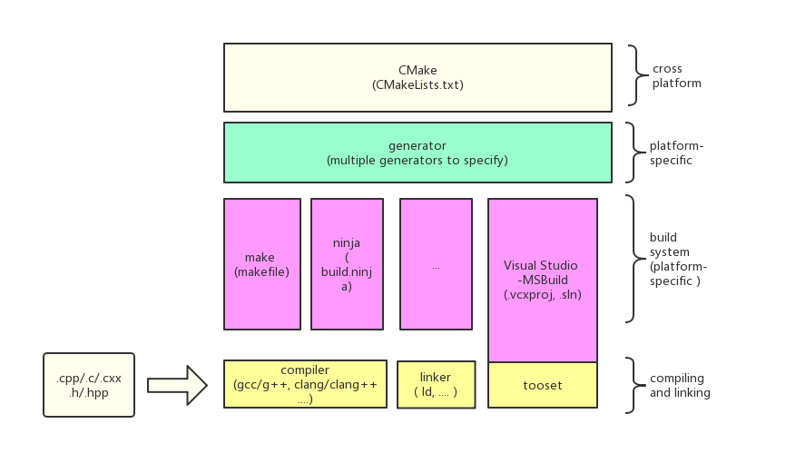
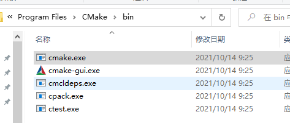
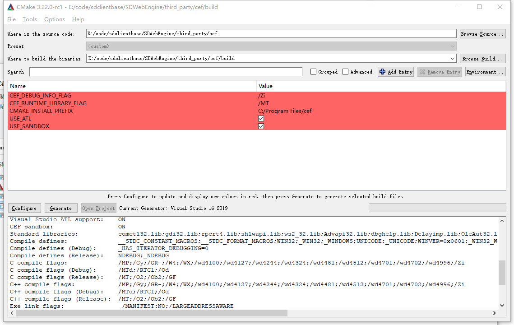
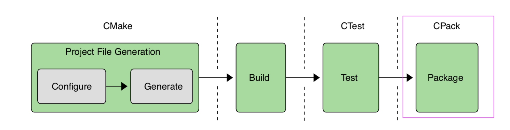
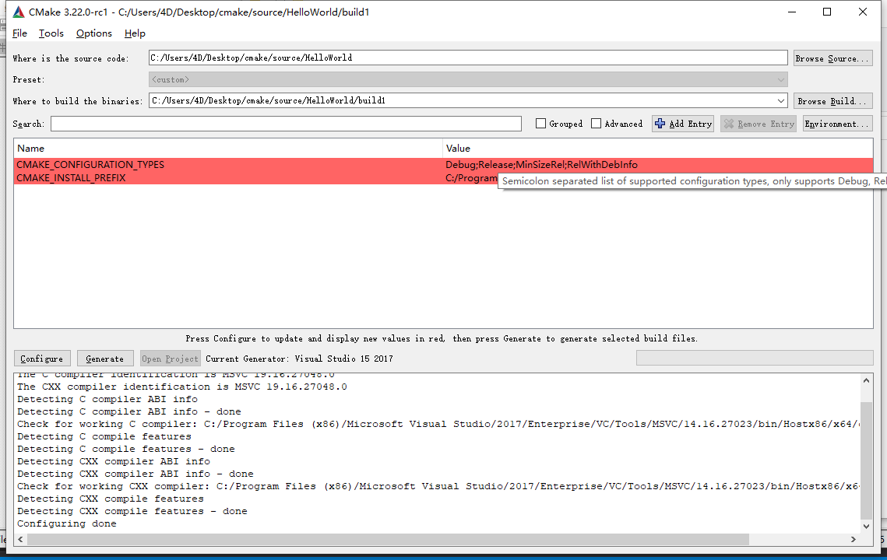
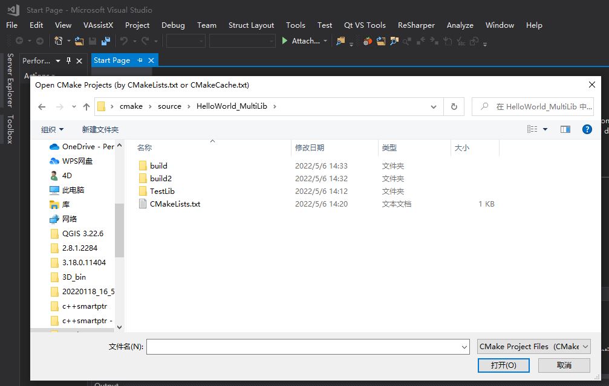

---
html:
  embed_local_images: false
  embed_svg: true
  offline: false
  toc: true

print_background: false
---

# CMake 快速入门

## ✨CMake是啥
> CMake 是一个**开源**、**跨平台**的工具，目的是解决在不同平台构建、测试和打包。 CMake 使用简单的独立于平台和编译器的配置文件来控制软件编译过程，它可以根据不同的平台和不同的偏于器生成具体平台的makefile文件或者ide使用的文件。

## ✨为啥会有CMake
**传统的跨平台开发痛点**
1. Linux 写makefile
2. windows 使用vcxproj
3. mac下使用xcode
导致我们需要维护不同平台的文件，非常繁琐和痛苦

**CMake提供的解决方案**



## ✨CMake提供了哪些工具
Windows端安装后目录文件
   
      

1. **cmake.exe** 命令行工具
2. **cmake-gui.exe** 带界面工具
  
3. **ctest.exe** 测试工具
4. **cpack.exe** 打包工具
   


## 如何获取CMake帮组
```sh
cmake --help

.....
Generators

The following generators are available on this platform (* marks default):
* Visual Studio 17 2022        = Generates Visual Studio 2022 project files.
                                 Use -A option to specify architecture.
  Visual Studio 16 2019        = Generates Visual Studio 2019 project files.
                                 Use -A option to specify architecture.
  Visual Studio 15 2017 [arch] = Generates Visual Studio 2017 project files.
                                 Optional [arch] can be "Win64" or "ARM".
  Visual Studio 14 2015 [arch] = Generates Visual Studio 2015 project files.
                                 Optional [arch] can be "Win64" or "ARM".
  Visual Studio 12 2013 [arch] = Generates Visual Studio 2013 project files.
                                 Optional [arch] can be "Win64" or "ARM".
  Visual Studio 11 2012 [arch] = Generates Visual Studio 2012 project files.
                                 Optional [arch] can be "Win64" or "ARM".
  Visual Studio 10 2010 [arch] = Deprecated.  Generates Visual Studio 2010
                                 project files.  Optional [arch] can be
                                 "Win64" or "IA64".
  Visual Studio 9 2008 [arch]  = Generates Visual Studio 2008 project files.
                                 Optional [arch] can be "Win64" or "IA64".
  Borland Makefiles            = Generates Borland makefiles.
  NMake Makefiles              = Generates NMake makefiles.
  NMake Makefiles JOM          = Generates JOM makefiles.
  MSYS Makefiles               = Generates MSYS makefiles.
  MinGW Makefiles              = Generates a make file for use with
                                 mingw32-make.
  Green Hills MULTI            = Generates Green Hills MULTI files
                                 (experimental, work-in-progress).
  Unix Makefiles               = Generates standard UNIX makefiles.
  Ninja                        = Generates build.ninja files.
  Ninja Multi-Config           = Generates build-<Config>.ninja files.
  Watcom WMake                 = Generates Watcom WMake makefiles.
  CodeBlocks - MinGW Makefiles = Generates CodeBlocks project files.
  CodeBlocks - NMake Makefiles = Generates CodeBlocks project files.
  CodeBlocks - NMake Makefiles JOM
                               = Generates CodeBlocks project files.
  CodeBlocks - Ninja           = Generates CodeBlocks project files.
  CodeBlocks - Unix Makefiles  = Generates CodeBlocks project files.
  CodeLite - MinGW Makefiles   = Generates CodeLite project files.
  CodeLite - NMake Makefiles   = Generates CodeLite project files.
  CodeLite - Ninja             = Generates CodeLite project files.
  CodeLite - Unix Makefiles    = Generates CodeLite project files.
  Eclipse CDT4 - NMake Makefiles
                               = Generates Eclipse CDT 4.0 project files.
  Eclipse CDT4 - MinGW Makefiles
                               = Generates Eclipse CDT 4.0 project files.
  Eclipse CDT4 - Ninja         = Generates Eclipse CDT 4.0 project files.
  Eclipse CDT4 - Unix Makefiles= Generates Eclipse CDT 4.0 project files.
  Kate - MinGW Makefiles       = Generates Kate project files.
  Kate - NMake Makefiles       = Generates Kate project files.
  Kate - Ninja                 = Generates Kate project files.
  Kate - Unix Makefiles        = Generates Kate project files.
  Sublime Text 2 - MinGW Makefiles
                               = Generates Sublime Text 2 project files.
  Sublime Text 2 - NMake Makefiles
                               = Generates Sublime Text 2 project files.
  Sublime Text 2 - Ninja       = Generates Sublime Text 2 project files.
  Sublime Text 2 - Unix Makefiles
                               = Generates Sublime Text 2 project files.
```
  
## ✨CMake 使用演示
### HelloWorld(exe)
HelloWorld.cpp
```
#include <iostream>

int main(int argc, char* argv[])
{
	std::cout << "Hello Word, CMake!!!" << std::endl;
}
```

CMakeLists.txt
```
cmake_minimum_required(VERSION 3.7)

project(HelloWorld)

add_executable(HelloWorld HelloWorld.cpp)
```

**方式1** 命令行
```sh
mkdir build
cd build
cmake -G "Visual Studio 15 2017 Win64" ..
cmake --build .
```

**方式2** GUI


**方式3** 使用Visual Studio打开CMakeLists.txt直接编译
File->Open->CMake



### HelloWord(exe) + static lib/ dynamic lib

##### 何为外部构建和内部构建
**外部构建**：我们这里创建build目录存放CMake生成的东西，编译也会在这目录进行，可以有效编码编译生成的东西和我们的代码文件混在一起
**内部构建**：直接在项目根目录下进行构建系统与编译，强烈不推荐


```c++
#ifndef TESTLIB_H
#define TESTLIB_H

#include "TestLib/export.h"

namespace TestLib {

TESTLIB_EXPORT int getResult();

}

#endif  //TESTLIB_H

```

```c++
#include "Helper.h"

namespace TestLib
{

int getResult()
{
	return 100;
}

}
```

```
cmake_minimum_required(VERSION 3.7)

project(TestLib VERSION 1.0.0)

## Create the main TestLib library target

option(BUILD_SHARED_LIBS "build shared library or not" ON)

add_library(TestLib Helper.cpp)
target_include_directories(
    TestLib PUBLIC "$<BUILD_INTERFACE:${CMAKE_CURRENT_SOURCE_DIR}/include>")

## Generate the export header for TestLib and attach it to the target

include(GenerateExportHeader)
generate_export_header(TestLib EXPORT_FILE_NAME include/TestLib/export.h)
target_compile_definitions(
    TestLib PUBLIC "$<$<NOT:$<BOOL:${BUILD_SHARED_LIBS}>>:TESTLIB_STATIC_DEFINE>")
message(${CMAKE_INSTALL_PREFIX})
target_include_directories(
    TestLib PUBLIC "$<BUILD_INTERFACE:${CMAKE_CURRENT_BINARY_DIR}/include>")
```

##### 生成动态库
```sh
cmake -G "Visual Studio 15 2017 Win64" .. -B build-shared -DBUILD_SHARED_LIBS=YES
cmake --build build-shared --config Release
cmake --install build-shared --prefix=C:/Users/4D/Desktop/cmake/source/HelloWorld_MultiLib/build/output/shared
cpack -C Release --config build-shared/CPackConfig.cmake
```

##### 生成静态库
```sh
cmake -G "Visual Studio 15 2017 Win64" .. -B build-static -DBUILD_SHARED_LIBS=NO
cmake --build build-static --config Release
cmake --install build-static --prefix=C:/Users/4D/Desktop/cmake/source/HelloWorld_MultiLib/build/output/static
```

##### 执行单元测试
```sh
cd build-static
ctest
```

##### 生成安装包
```sh
cpack -C Release --config build-shared/CPackConfig.cmake
```

## 除了CMake是否还有其他选择？
当然有的
1. google的GYP以及其继任者**gn**
2. qmake
3. meson
4. GNU autotools
5. SCons