---
html:
  embed_local_images: false
  embed_svg: true
  offline: false
  toc: true

print_background: false
---

# windbg快速入门
### 1. windbg启动进程

```
windbg.exe notepad.exe
```
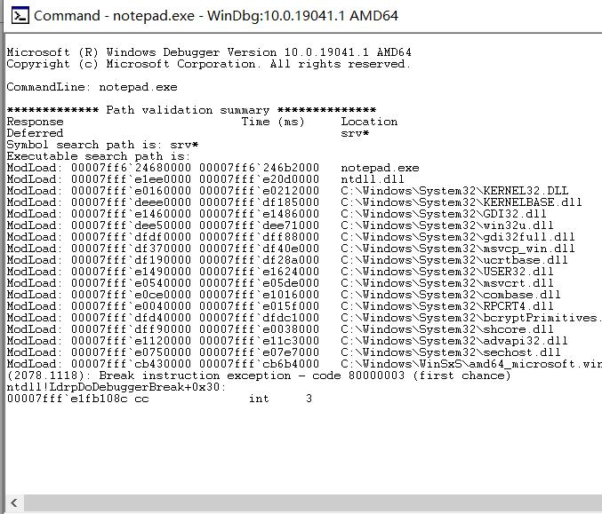

### 2. 查看启动进程的命令行参数
```
vercommand
```
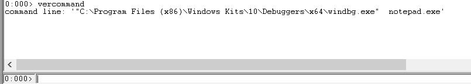

### 3. 查看当前符号查找路径
```
.sympath

```
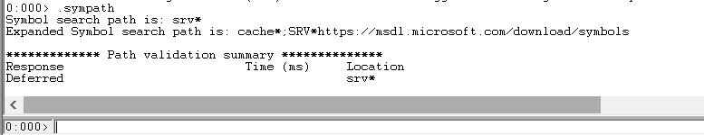

### 4. 查看符号信息
```
lmvm
!itoldyouso
!lmi
!chksym


0:000> !chksym WindowDemo.exe

WindowDemo.exe
    Timestamp: 616FD730
  SizeOfImage: 22000
          pdb: C:\Users\4D\Downloads\WindowDemo\x64\Release\WindowDemo.pdb
      pdb sig: C920CD76-FF85-42B4-A3CA-2DC21155CD03
          age: 1

```


### 5. 重置符号查找路径
```
.symfix

```
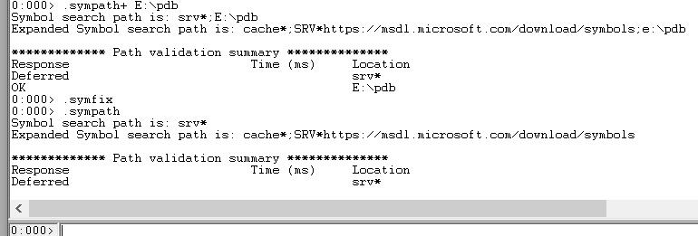

### 6. 添加符号路径
```
.sympath+ E:\pdb

```
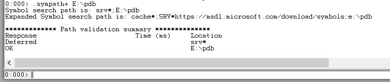

### 7. 刷新符号信息
```
.reload
.reload /f ideation.exe

```

### 8. 当前源码搜索路径
```
.srcpath

```

### 9. 添加源码搜索路径
```
.srcpath+ E:\code

```

### 10. 调用堆栈
```
k
kn
kb

```

### 11. 在栈帧间跳转
```
kn
.frame 0
.frame 2

```

### 11. 列举进程加载的模块
```
lm
lmv m ntdll

0:000> lm
start             end                 module name
00007ff7`863b0000 00007ff7`863d2000   WindowDemo   (deferred)             
00007ffc`c40c0000 00007ffc`c414d000   MSVCP140   (deferred)             
00007ffc`d7f20000 00007ffc`d7f3a000   VCRUNTIME140   (deferred)             
00007ffc`e00e0000 00007ffc`e00ec000   VCRUNTIME140_1   (deferred)             
00007ffc`e4ec0000 00007ffc`e4ee2000   win32u     (deferred)             
00007ffc`e4f80000 00007ffc`e501d000   msvcp_win   (deferred)             
00007ffc`e5020000 00007ffc`e52e9000   KERNELBASE   (deferred)             
00007ffc`e53f0000 00007ffc`e54f0000   ucrtbase   (deferred)             
00007ffc`e54f0000 00007ffc`e55fb000   gdi32full   (deferred)             
00007ffc`e5830000 00007ffc`e59d1000   USER32     (deferred)             
00007ffc`e65c0000 00007ffc`e65eb000   GDI32      (deferred)             
00007ffc`e74b0000 00007ffc`e756e000   KERNEL32   (deferred)             
00007ffc`e75b0000 00007ffc`e77a5000   ntdll      (pdb symbols)          C:\ProgramData\dbg\sym\ntdll.pdb\96EF4ED537402DAAA51D4A4212EA4B2C1\ntdll.pdb

```

### 12. 解析函数函数地址
```
x ideation!main*

```

### 13. 断点相关
```
bp kernel!CreateFileW
bp 0x00544442
bp `source.c:12`
bp /w "localVariable == 4" mymodule!myfunction
bl
bd 0
be 0
bc 0

```

### 14. 列举线程
```
~
~*

0:003> ~*
#  0  Id: 9d4c.6364 Suspend: 1 Teb: 0000008c`68a32000 Unfrozen
      Start: WindowDemo!wWinMainCRTStartup (00007ff7`863b270c)
      Priority: 0  Priority class: 32  Affinity: ffff
   1  Id: 9d4c.6b40 Suspend: 1 Teb: 0000008c`68a34000 Unfrozen
      Start: 00000272`d4250000
      Priority: 0  Priority class: 32  Affinity: ffff
   2  Id: 9d4c.1af0 Suspend: 1 Teb: 0000008c`68a36000 Unfrozen
      Start: ntdll!TppWorkerThread (00007ffc`e7602ad0)
      Priority: 0  Priority class: 32  Affinity: ffff
.  3  Id: 9d4c.8e38 Suspend: 1 Teb: 0000008c`68a38000 Unfrozen
      Start: ntdll!TppWorkerThread (00007ffc`e7602ad0)
      Priority: 0  Priority class: 32  Affinity: ffff
   4  Id: 9d4c.a314 Suspend: 1 Teb: 0000008c`68a3a000 Unfrozen
      Start: ntdll!TppWorkerThread (00007ffc`e7602ad0)
      Priority: 0  Priority class: 32  Affinity: ffff


```

### 15. 切换线程
```
~0s

```

### 16. 显示线程堆栈
```
~0k
~*k
~*k 50

```

### 17. 显示函数调用参数
```
kP

```

### 18. 显示局部参数
```
dv
dw

```

### 20. 寄存器
```
r
```

### 21. x64版windbg调试x86程序
```
0:003> .load wow64exts
0:003> !wow64exts.sw  //这指令可以在x64和win32来回切换
Switched to Guest (WoW) mode
```

### 22. 抓dump文件
```
.dump /ma /o d:\dump\crash.dmp
```

### 23. 清屏
```
.cls
```

### 24. 结束调试回话
```
q
qd

```

### 25. 获取帮助
```
格式如
.hh command

例如
.hh .dump

```

# 实践应用
### 1. 解决pdb不匹配的问题
模块(exe.dll)和pdb配对的原则是：**guid**
```
dumpbin /headers C:\Users\4D\Downloads\WindowDemo1\x64\WindowDemo.exe

 Debug Directories

        Time Type        Size      RVA  Pointer
    -------- ------- -------- -------- --------
    616FD730 cv            54 00004BE4     35E4    Format: RSDS, {C920CD76-FF85-42B4-A3CA-2DC21155CD03}, 1, C:\Users\4D\Downloads\WindowDemo\x64\Release\WindowDemo.pdb
    616FD730 feat          14 00004C38     3638    Counts: Pre-VC++ 11.00=0, C/C++=45, /GS=45, /sdl=9, guardN=36
    616FD730 coffgrp      2A4 00004C4C     364C    4C544347 (LTCG)
    616FD730 iltcg          0 00000000        0
```
最新的**pdb**的格式目前微软没有文档详细描述它的布局分布，只是提供了Debug Interface Access SDK 可以通过它提供的api获取一些信息,但是我们用hexeditor以16进制的方式查看pdb文件还是能查出些有用的信息

**pdb版本描述**
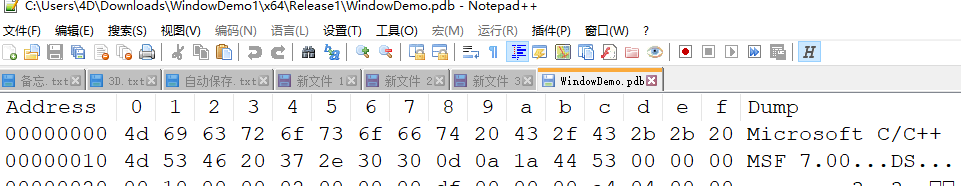

**GUID在这**
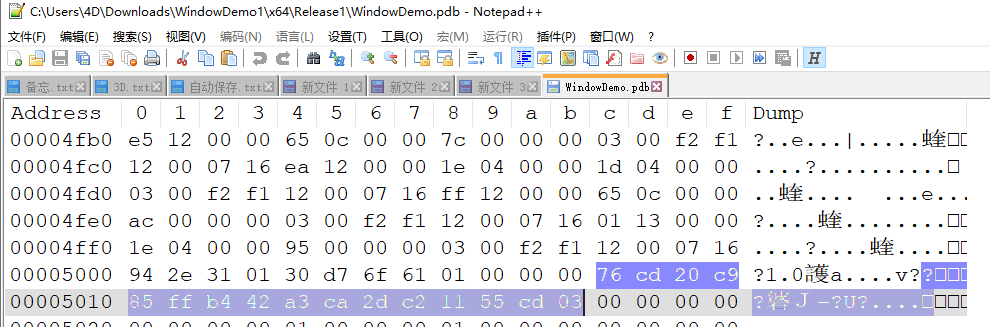

**symview工具查看PDB文件**
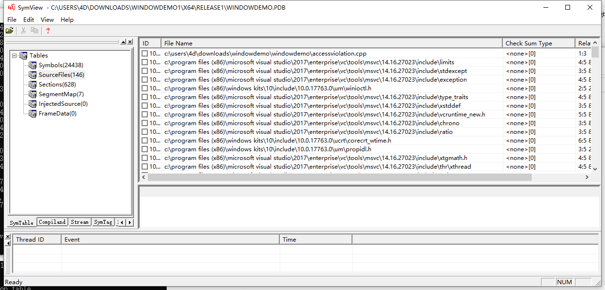

**!sym noisy**
```

Microsoft (R) Windows Debugger Version 10.0.17763.132 AMD64
Copyright (c) Microsoft Corporation. All rights reserved.

CommandLine: C:\Users\4D\Downloads\WindowDemo1\x64\WindowDemo.exe
Symbol search path is: srv*
Executable search path is: 
ModLoad: 00007ff7`863b0000 00007ff7`863d2000   WindowDemo.exe
ModLoad: 00007ffc`e75b0000 00007ffc`e77a5000   ntdll.dll
ModLoad: 00007ffc`e74b0000 00007ffc`e756e000   C:\Windows\System32\KERNEL32.DLL
ModLoad: 00007ffc`e5020000 00007ffc`e52e9000   C:\Windows\System32\KERNELBASE.dll
ModLoad: 00007ffc`e5830000 00007ffc`e59d1000   C:\Windows\System32\USER32.dll
ModLoad: 00007ffc`e4ec0000 00007ffc`e4ee2000   C:\Windows\System32\win32u.dll
ModLoad: 00007ffc`e65c0000 00007ffc`e65eb000   C:\Windows\System32\GDI32.dll
ModLoad: 00007ffc`e54f0000 00007ffc`e55fb000   C:\Windows\System32\gdi32full.dll
ModLoad: 00007ffc`e4f80000 00007ffc`e501d000   C:\Windows\System32\msvcp_win.dll
ModLoad: 00007ffc`e53f0000 00007ffc`e54f0000   C:\Windows\System32\ucrtbase.dll
ModLoad: 00007ffc`c40c0000 00007ffc`c414d000   C:\Windows\SYSTEM32\MSVCP140.dll
ModLoad: 00007ffc`d7f20000 00007ffc`d7f3a000   C:\Windows\SYSTEM32\VCRUNTIME140.dll
ModLoad: 00007ffc`e00e0000 00007ffc`e00ec000   C:\Windows\SYSTEM32\VCRUNTIME140_1.dll
(9d4c.6364): Break instruction exception - code 80000003 (first chance)
ntdll!LdrpDoDebuggerBreak+0x30:
00007ffc`e76806b0 cc              int     3
0:000> lm
start             end                 module name
00007ff7`863b0000 00007ff7`863d2000   WindowDemo   (deferred)             
00007ffc`c40c0000 00007ffc`c414d000   MSVCP140   (deferred)             
00007ffc`d7f20000 00007ffc`d7f3a000   VCRUNTIME140   (deferred)             
00007ffc`e00e0000 00007ffc`e00ec000   VCRUNTIME140_1   (deferred)             
00007ffc`e4ec0000 00007ffc`e4ee2000   win32u     (deferred)             
00007ffc`e4f80000 00007ffc`e501d000   msvcp_win   (deferred)             
00007ffc`e5020000 00007ffc`e52e9000   KERNELBASE   (deferred)             
00007ffc`e53f0000 00007ffc`e54f0000   ucrtbase   (deferred)             
00007ffc`e54f0000 00007ffc`e55fb000   gdi32full   (deferred)             
00007ffc`e5830000 00007ffc`e59d1000   USER32     (deferred)             
00007ffc`e65c0000 00007ffc`e65eb000   GDI32      (deferred)             
00007ffc`e74b0000 00007ffc`e756e000   KERNEL32   (deferred)             
00007ffc`e75b0000 00007ffc`e77a5000   ntdll      (pdb symbols)          C:\ProgramData\dbg\sym\ntdll.pdb\96EF4ED537402DAAA51D4A4212EA4B2C1\ntdll.pdb
0:000> !sym noisy
noisy mode - symbol prompts on
0:000> .reload /f WindowDemo.exe
SYMSRV:  BYINDEX: 0x2
         C:\ProgramData\dbg\sym
         WindowDemo.pdb
         C920CD76FF8542B4A3CA2DC21155CD031
SYMSRV:  UNC: C:\ProgramData\dbg\sym\WindowDemo.pdb\C920CD76FF8542B4A3CA2DC21155CD031\WindowDemo.pdb - path not found
SYMSRV:  UNC: C:\ProgramData\dbg\sym\WindowDemo.pdb\C920CD76FF8542B4A3CA2DC21155CD031\WindowDemo.pd_ - path not found
SYMSRV:  UNC: C:\ProgramData\dbg\sym\WindowDemo.pdb\C920CD76FF8542B4A3CA2DC21155CD031\file.ptr - path not found
SYMSRV:  RESULT: 0x80070003
SYMSRV:  BYINDEX: 0x3
         C:\ProgramData\dbg\sym*https://msdl.microsoft.com/download/symbols
         WindowDemo.pdb
         C920CD76FF8542B4A3CA2DC21155CD031
SYMSRV:  UNC: C:\ProgramData\dbg\sym\WindowDemo.pdb\C920CD76FF8542B4A3CA2DC21155CD031\WindowDemo.pdb - path not found
SYMSRV:  UNC: C:\ProgramData\dbg\sym\WindowDemo.pdb\C920CD76FF8542B4A3CA2DC21155CD031\WindowDemo.pd_ - path not found
SYMSRV:  UNC: C:\ProgramData\dbg\sym\WindowDemo.pdb\C920CD76FF8542B4A3CA2DC21155CD031\file.ptr - path not found
SYMSRV:  HTTPGET: /download/symbols/index2.txt
SYMSRV:  HttpQueryInfo: 80190194 - HTTP_STATUS_NOT_FOUND
SYMSRV:  HTTPGET: /download/symbols/WindowDemo.pdb/C920CD76FF8542B4A3CA2DC21155CD031/WindowDemo.pdb
SYMSRV:  HttpQueryInfo: 80190194 - HTTP_STATUS_NOT_FOUND
SYMSRV:  HTTPGET: /download/symbols/WindowDemo.pdb/C920CD76FF8542B4A3CA2DC21155CD031/WindowDemo.pd_
SYMSRV:  HttpQueryInfo: 80190194 - HTTP_STATUS_NOT_FOUND
SYMSRV:  HTTPGET: /download/symbols/WindowDemo.pdb/C920CD76FF8542B4A3CA2DC21155CD031/file.ptr
SYMSRV:  HttpQueryInfo: 80190194 - HTTP_STATUS_NOT_FOUND
SYMSRV:  RESULT: 0x80190194
DBGHELP: C:\Users\4D\Downloads\WindowDemo\x64\Release\WindowDemo.pdb - file not found
*** WARNING: Unable to verify checksum for WindowDemo.exe
*** ERROR: Module load completed but symbols could not be loaded for WindowDemo.exe
DBGHELP: WindowDemo - no symbols loaded

************* Symbol Loading Error Summary **************
Module name            Error
WindowDemo             The system cannot find the file specified
				The SYMSRV client failed to find a file in the UNC store, or there
				is an invalid UNC store (an invalid path or the pingme.txt file is
				not present in the root directory), or the file is present in the
				symbol server exclusion list.

0:000> .sympath
Symbol search path is: srv*
Expanded Symbol search path is: cache*;SRV*https://msdl.microsoft.com/download/symbols

************* Path validation summary **************
Response                         Time (ms)     Location
Deferred                                       srv*
0:000> .sympath+ C:\Users\4D\Downloads\WindowDemo1\x64\Release1
DBGHELP: Symbol Search Path: cache*;SRV*https://msdl.microsoft.com/download/symbols;c:\users\4d\downloads\windowdemo1\x64\release1
SYMSRV:  BYINDEX: 0x4
         C:\ProgramData\dbg\sym
         ntdll.pdb
         96EF4ED537402DAAA51D4A4212EA4B2C1
SYMSRV:  PATH: C:\ProgramData\dbg\sym\ntdll.pdb\96EF4ED537402DAAA51D4A4212EA4B2C1\ntdll.pdb
SYMSRV:  RESULT: 0x00000000
DBGHELP: ntdll - public symbols  
        C:\ProgramData\dbg\sym\ntdll.pdb\96EF4ED537402DAAA51D4A4212EA4B2C1\ntdll.pdb
Symbol search path is: srv*;C:\Users\4D\Downloads\WindowDemo1\x64\Release1
Expanded Symbol search path is: cache*;SRV*https://msdl.microsoft.com/download/symbols;c:\users\4d\downloads\windowdemo1\x64\release1

************* Path validation summary **************
Response                         Time (ms)     Location
Deferred                                       srv*
OK                                             C:\Users\4D\Downloads\WindowDemo1\x64\Release1
0:000> .reload /f WindowDemo.exe
SYMSRV:  BYINDEX: 0x5
         C:\ProgramData\dbg\sym
         WindowDemo.pdb
         C920CD76FF8542B4A3CA2DC21155CD031
SYMSRV:  UNC: C:\ProgramData\dbg\sym\WindowDemo.pdb\C920CD76FF8542B4A3CA2DC21155CD031\WindowDemo.pdb - path not found
SYMSRV:  UNC: C:\ProgramData\dbg\sym\WindowDemo.pdb\C920CD76FF8542B4A3CA2DC21155CD031\WindowDemo.pd_ - path not found
SYMSRV:  UNC: C:\ProgramData\dbg\sym\WindowDemo.pdb\C920CD76FF8542B4A3CA2DC21155CD031\file.ptr - path not found
SYMSRV:  RESULT: 0x80070003
SYMSRV:  BYINDEX: 0x6
         C:\ProgramData\dbg\sym*https://msdl.microsoft.com/download/symbols
         WindowDemo.pdb
         C920CD76FF8542B4A3CA2DC21155CD031
SYMSRV:  UNC: C:\ProgramData\dbg\sym\WindowDemo.pdb\C920CD76FF8542B4A3CA2DC21155CD031\WindowDemo.pdb - path not found
SYMSRV:  UNC: C:\ProgramData\dbg\sym\WindowDemo.pdb\C920CD76FF8542B4A3CA2DC21155CD031\WindowDemo.pd_ - path not found
SYMSRV:  UNC: C:\ProgramData\dbg\sym\WindowDemo.pdb\C920CD76FF8542B4A3CA2DC21155CD031\file.ptr - path not found
SYMSRV:  HTTPGET: /download/symbols/WindowDemo.pdb/C920CD76FF8542B4A3CA2DC21155CD031/WindowDemo.pdb
SYMSRV:  HttpQueryInfo: 80190194 - HTTP_STATUS_NOT_FOUND
SYMSRV:  HTTPGET: /download/symbols/WindowDemo.pdb/C920CD76FF8542B4A3CA2DC21155CD031/WindowDemo.pd_
SYMSRV:  HttpQueryInfo: 80190194 - HTTP_STATUS_NOT_FOUND
SYMSRV:  HTTPGET: /download/symbols/WindowDemo.pdb/C920CD76FF8542B4A3CA2DC21155CD031/file.ptr
SYMSRV:  HttpQueryInfo: 80190194 - HTTP_STATUS_NOT_FOUND
SYMSRV:  RESULT: 0x80190194
SYMSRV:  UNC: C:\ProgramData\dbg\sym\WindowDemo.pdb\C920CD76FF8542B4A3CA2DC21155CD031\WindowDemo.pdb - path not found
SYMSRV:  UNC: C:\ProgramData\dbg\sym\WindowDemo.pdb\C920CD76FF8542B4A3CA2DC21155CD031\WindowDemo.pd_ - path not found
SYMSRV:  UNC: C:\ProgramData\dbg\sym\WindowDemo.pdb\C920CD76FF8542B4A3CA2DC21155CD031\file.ptr - path not found
DBGHELP: c:\users\4d\downloads\windowdemo1\x64\release1\WindowDemo.pdb cached to C:\ProgramData\dbg\sym\WindowDemo.pdb\C920CD76FF8542B4A3CA2DC21155CD031\WindowDemo.pdb
*** WARNING: Unable to verify checksum for WindowDemo.exe
DBGHELP: WindowDemo - private symbols & lines 
        C:\ProgramData\dbg\sym\WindowDemo.pdb\C920CD76FF8542B4A3CA2DC21155CD031\WindowDemo.pdb

```


**!srcnoisy 3**
```

Microsoft (R) Windows Debugger Version 10.0.17763.132 AMD64
Copyright (c) Microsoft Corporation. All rights reserved.

CommandLine: C:\Users\4D\Downloads\WindowDemo1\x64\WindowDemo.exe
Symbol search path is: srv*
Executable search path is: 
ModLoad: 00007ff7`863b0000 00007ff7`863d2000   WindowDemo.exe
ModLoad: 00007ffc`e75b0000 00007ffc`e77a5000   ntdll.dll
ModLoad: 00007ffc`e74b0000 00007ffc`e756e000   C:\Windows\System32\KERNEL32.DLL
ModLoad: 00007ffc`e5020000 00007ffc`e52e9000   C:\Windows\System32\KERNELBASE.dll
ModLoad: 00007ffc`e5830000 00007ffc`e59d1000   C:\Windows\System32\USER32.dll
ModLoad: 00007ffc`e4ec0000 00007ffc`e4ee2000   C:\Windows\System32\win32u.dll
ModLoad: 00007ffc`e65c0000 00007ffc`e65eb000   C:\Windows\System32\GDI32.dll
ModLoad: 00007ffc`e54f0000 00007ffc`e55fb000   C:\Windows\System32\gdi32full.dll
ModLoad: 00007ffc`e4f80000 00007ffc`e501d000   C:\Windows\System32\msvcp_win.dll
ModLoad: 00007ffc`e53f0000 00007ffc`e54f0000   C:\Windows\System32\ucrtbase.dll
ModLoad: 00007ffc`c40c0000 00007ffc`c414d000   C:\Windows\SYSTEM32\MSVCP140.dll
ModLoad: 00007ffc`d7f20000 00007ffc`d7f3a000   C:\Windows\SYSTEM32\VCRUNTIME140.dll
ModLoad: 00007ffc`e00e0000 00007ffc`e00ec000   C:\Windows\SYSTEM32\VCRUNTIME140_1.dll
(4a08.b174): Break instruction exception - code 80000003 (first chance)
ntdll!LdrpDoDebuggerBreak+0x30:
00007ffc`e76806b0 cc              int     3
0:000> .srcnoisy 3
Noisy source output: on
Noisy source server output: on
Filter out everything but source server output: on
0:000> x WindowDemo!*main*
SYMSRV:  BYINDEX: 0x2
         C:\ProgramData\dbg\sym
         WindowDemo.pdb
         C920CD76FF8542B4A3CA2DC21155CD031
SYMSRV:  PATH: C:\ProgramData\dbg\sym\WindowDemo.pdb\C920CD76FF8542B4A3CA2DC21155CD031\WindowDemo.pdb
SYMSRV:  RESULT: 0x00000000
*** WARNING: Unable to verify checksum for WindowDemo.exe
DBGHELP: WindowDemo - private symbols & lines 
        C:\ProgramData\dbg\sym\WindowDemo.pdb\C920CD76FF8542B4A3CA2DC21155CD031\WindowDemo.pdb
00007ff7`863b7010 WindowDemo!__scrt_native_dllmain_reason = 0xffffffff
00007ff7`863b1f00 WindowDemo!wWinMain (struct HINSTANCE__ *, struct HINSTANCE__ *, wchar_t *, int)
00007ff7`863b270c WindowDemo!wWinMainCRTStartup (void)
00007ff7`863b2598 WindowDemo!__scrt_common_main_seh (void)
00007ff7`863b34e0 WindowDemo!`__scrt_common_main_seh'::`1'::filt$0 (void)
00007ff7`863b42e8 WindowDemo!_imp__get_wide_winmain_command_line = <no type information>
00007ff7`863b32a0 WindowDemo!get_wide_winmain_command_line (<no parameter info>)
00007ff7`863b267d WindowDemo!invoke_main =  (inline caller) WindowDemo!__scrt_common_main_seh+e5
00007ff7`863b24ba WindowDemo!__scrt_winmain_policy::set_app_type =  (inline caller) WindowDemo!pre_c_initialization+6
00007ff7`863b2710 WindowDemo!__scrt_common_main =  (inline caller) WindowDemo!wWinMainCRTStartup+4
0:000> bp WindowDemo!wWinMain
0:000> g
ModLoad: 00007ffc`e7180000 00007ffc`e71b0000   C:\Windows\System32\IMM32.DLL
ModLoad: 00007ffc`c4860000 00007ffc`c48cb000   C:\Windows\LVUAAgentInstBaseRoot\system32\Vozokopot.dll
Breakpoint 0 hit
WindowDemo!wWinMain:
00007ff7`863b1f00 48895c2410      mov     qword ptr [rsp+10h],rbx ss:00000092`5475fdb8=0000000000000000
DBGENG:  Check plain file:
DBGENG:    'c:\users\4d\downloads\windowdemo\windowdemo\windowdemo.cpp' - not found
0:000> .srcpath+ D:\WindowDemo
Source search path is: D:\WindowDemo

************* Path validation summary **************
Response                         Time (ms)     Location
OK                                             D:\WindowDemo
DBGENG:  Scan paths for partial path match:
DBGENG:    prefix 'c:\users\4d\downloads\windowdemo\windowdemo'
DBGENG:    suffix 'windowdemo.cpp'
DBGENG:      match 'D:\WindowDemo' against 'c:\users\4d\downloads\windowdemo\windowdemo': 32 (match 'windowdemo')
DBGENG:      check 'D:\windowdemo\windowdemo.cpp'
DBGENG:      found file 'D:\windowdemo\windowdemo.cpp'

```


### 2. JIT(Just-In-Time Debugger)  实时调试
**异常分发处理的机制**
理解windows异常分发机制,请看这张图(摘自Windows Internal Chapter 3)
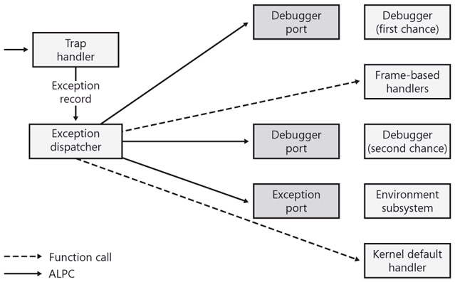 

**内核中的调试端口**
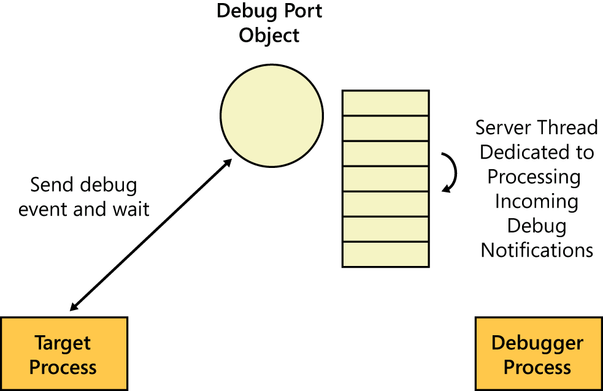 
\
\
\
\
**first-chance/second-chance**
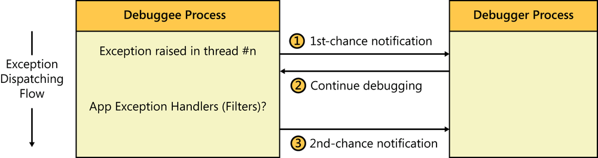
\
\
\
**应用场景**：应用发生未处理异常即将崩溃退出的时候操作系统会自动调用默认调试器附加到崩溃的应用程序

提示：以前的window应用崩溃会自动弹出WER窗口，如
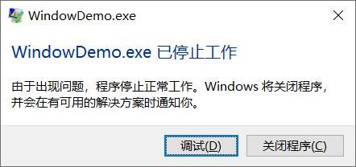

但是测试下来在有些机器看不到这个窗口了，应用程序崩溃后直接就闪退了，其实是可以通过运行设置启用显示WER窗口的

运行
**gpedit.msc**

进行如下设置，即可启用
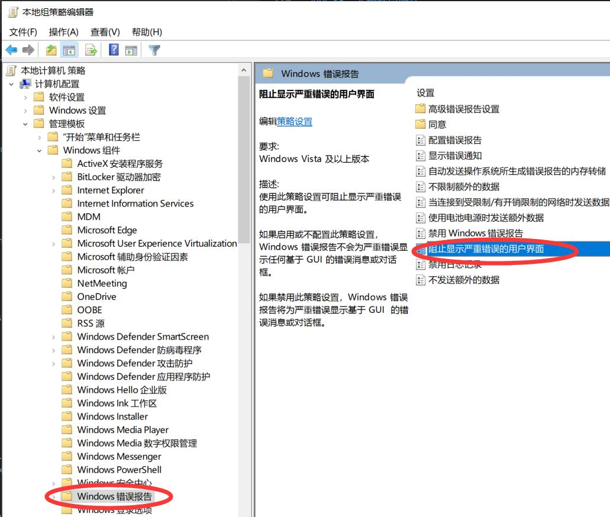


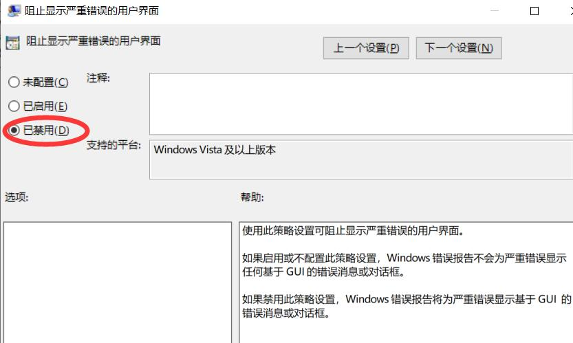

```
HKLM\SOFTWARE\Microsoft\Windows NT\CurrentVersion\AeDebug
HKLM\SOFTWARE\Wow6432Node\Microsoft\Windows NT\CurrentVersion\AeDebug
```

设置WinDbg为系统默认的实时调试器

```
管理员运行cmd，然后执行(32bit windbg)
C:\Program Files (x86)\Windows Kits\10\Debuggers\x86>windbg.exe /I

或者 64bit windbg
C:\Program Files (x86)\Windows Kits\10\Debuggers\x64>windbg.exe /I
```

安装成功
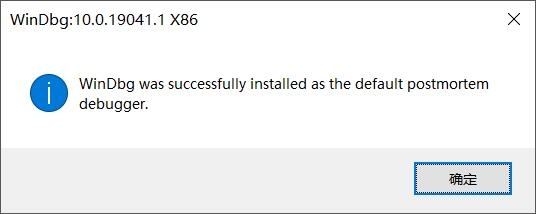

32bit windbg会写注册表项
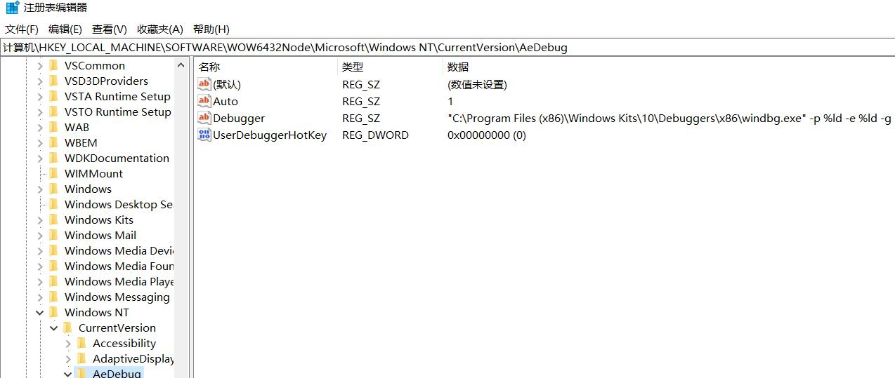

64bit windbg会写注册表项
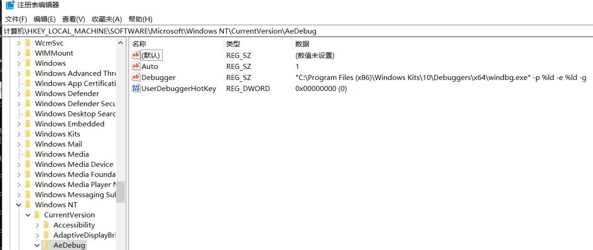

当发生未处理异常的时候
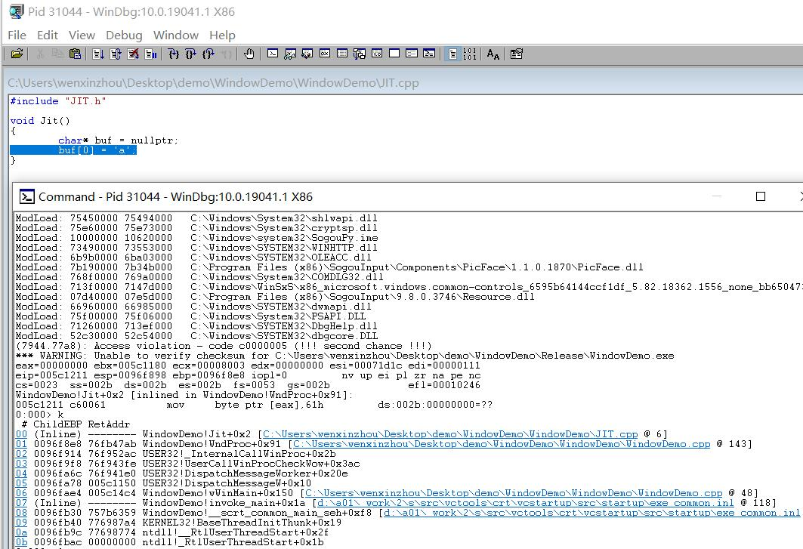

其实vs也是支持即时调试的，可通过管理员权限运行vs，然后设置
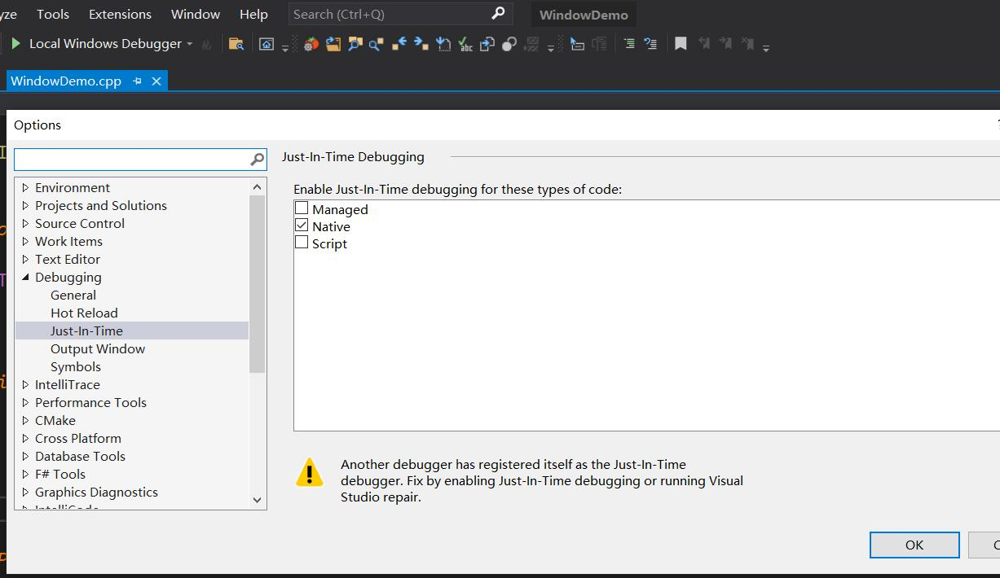

如果电脑安装了多个vs版本，会出现选择实时调试程序对话框
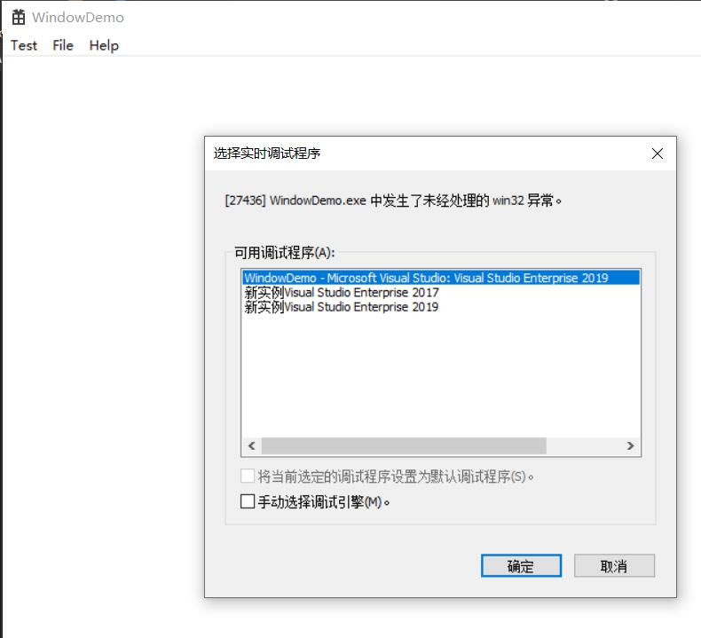

当发生未处理异常的时候


### 3. 转储调试
**完全转储（full dump）**
捕获目标进程的整个内存空间+进程的句柄表信息，
**微转储（mini dump）**
这个名称给人直觉会比full dump小，其实不然，这种类型的转储可以更好的控制哪些内容需要生成到最终的dump文件中，所以有可能mini dump生成的文件比full dump还大

我们看下minidump支持的配置
```
minidumpapiset.h

typedef enum _MINIDUMP_TYPE {
    MiniDumpNormal                         = 0x00000000,
    MiniDumpWithDataSegs                   = 0x00000001,
    MiniDumpWithFullMemory                 = 0x00000002,
    MiniDumpWithHandleData                 = 0x00000004,
    MiniDumpFilterMemory                   = 0x00000008,
    MiniDumpScanMemory                     = 0x00000010,
    MiniDumpWithUnloadedModules            = 0x00000020,
    MiniDumpWithIndirectlyReferencedMemory = 0x00000040,
    MiniDumpFilterModulePaths              = 0x00000080,
    MiniDumpWithProcessThreadData          = 0x00000100,
    MiniDumpWithPrivateReadWriteMemory     = 0x00000200,
    MiniDumpWithoutOptionalData            = 0x00000400,
    MiniDumpWithFullMemoryInfo             = 0x00000800,
    MiniDumpWithThreadInfo                 = 0x00001000,
    MiniDumpWithCodeSegs                   = 0x00002000,
    MiniDumpWithoutAuxiliaryState          = 0x00004000,
    MiniDumpWithFullAuxiliaryState         = 0x00008000,
    MiniDumpWithPrivateWriteCopyMemory     = 0x00010000,
    MiniDumpIgnoreInaccessibleMemory       = 0x00020000,
    MiniDumpWithTokenInformation           = 0x00040000,
    MiniDumpWithModuleHeaders              = 0x00080000,
    MiniDumpFilterTriage                   = 0x00100000,
    MiniDumpWithAvxXStateContext           = 0x00200000,
    MiniDumpWithIptTrace                   = 0x00400000,
    MiniDumpScanInaccessiblePartialPages   = 0x00800000,
    MiniDumpValidTypeFlags                 = 0x00fffff
```


**方式1**.通过配置注册表项自动生成dump文件
管理员权限运行cmd命令行  DumpType： 1: minidump, 2: full dump
DumpFolder：dump生成文件夹
```
reg.exe add "HKLM\Software\Microsoft\Windows\Windows Error Reporting\LocalDumps" /f
reg.exe add "HKLM\Software\Microsoft\Windows\Windows Error Reporting\LocalDumps" /v DumpType /t REG_DWORD /d 1 /f
reg.exe add "HKLM\Software\Microsoft\Windows\Windows Error Reporting\LocalDumps" /v DumpFolder /t REG_EXPAND_SZ /d d:\dumps /f
```
这时候发生异常崩溃则会在我们指定的路径生成dump文件
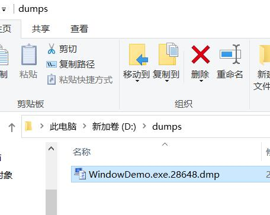

```
启动windbg分析dmp文件
windbg.exe -z d:\dumps\WindowDemo.exe.28648.dmp
0:000> !analyze -v
```
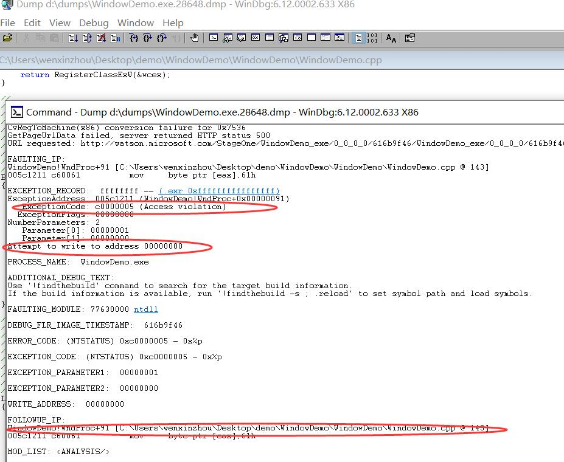

**方式2**.手动生成dump文件
1. windbg
```
0:000> .dump /ma /o d:\dumps\exception.dmp
```
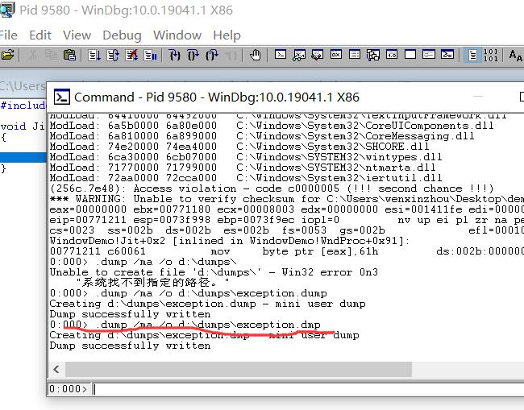

2. vs 生成dump
顶部菜单debug->save dump as

3. 任务管理器-右键对应进程-创建转储文件(C)

4. SysinternalsSuite-procdump.exe/procexp.exe

### 4. 远程调试

- #### 远程会话
    
    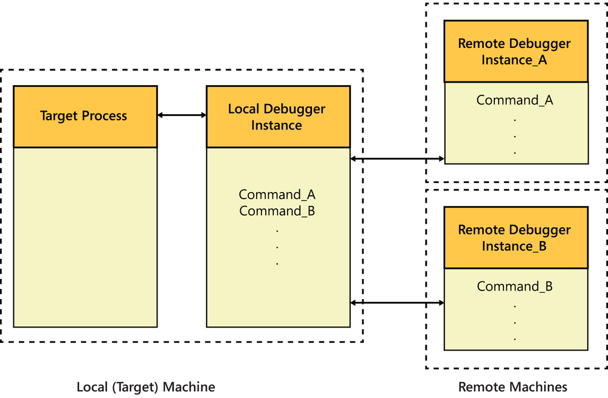
 ```
 目标机器运行(被调试进程所在的机器,ip=192.168.6.41)
 启动windbg，在windbg命令栏输入
 .server -t tcp:port=5003

调试器所在机器运行
 windbg.exe -remote tcp:port=5003,server=192.168.6.41
 ```
- #### 远程插桩
   
  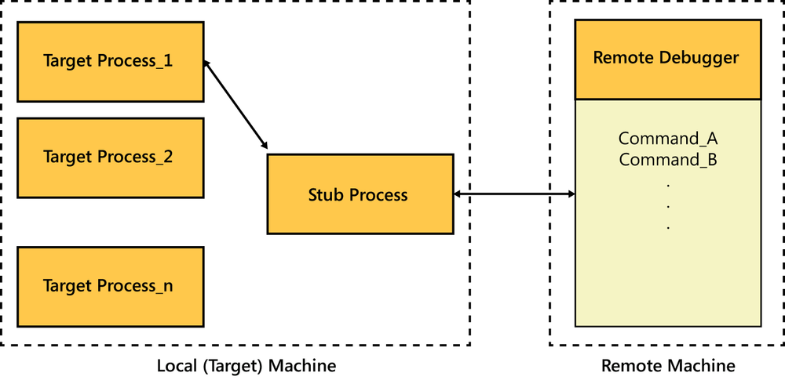
 ```
目标机器运行(被调试进程所在的机器,ip=192.168.6.41)
 dbgsrv.exe -t tcp:port=5004

调试器所在机器运行
 windbg.exe -premote tcp:port=5004,server=192.168.6.41
 ```

### 5. 内存地址非法访问
1.试图写入只读区域
```
const char* g_mess = "123";
void AccessViolation()
{
	char* p = (char*)g_mess;
	p[0] = 'a';
}
```

使用windbg打开dmp文件
```
Microsoft (R) Windows Debugger Version 10.0.19041.1 X86
Copyright (c) Microsoft Corporation. All rights reserved.


Loading Dump File [D:\dumps\1.dmp]
User Dump File: Only application data is available

Symbol search path is: srv*
Executable search path is: 
Windows 10 Version 18363 UP Free x86 compatible
Product: WinNt, suite: TerminalServer SingleUserTS
Machine Name:
Debug session time: Sun Oct 17 19:51:11.668 2021 (UTC + 8:00)
System Uptime: 53 days 20:49:56.143
Process Uptime: not available
................................
(26d8.7428): Access violation - code c0000005 (!!! second chance !!!)
For analysis of this file, run !analyze -v
*** WARNING: Unable to verify checksum for WindowDemo.exe
eax=00533140 ebx=00531210 ecx=00000001 edx=00000000 esi=00000000 edi=00000111
eip=00531017 esp=00affafc ebp=00affb00 iopl=0         nv up ei pl nz na pe nc
cs=0023  ss=002b  ds=002b  es=002b  fs=0053  gs=002b             efl=00010206
WindowDemo!AccessViolation+0x17:
00531017 c6041061        mov     byte ptr [eax+edx],61h     ds:002b:00533140=31
0:000> !analyze -v
*******************************************************************************
*                                                                             *
*                        Exception Analysis                                   *
*                                                                             *
*******************************************************************************


KEY_VALUES_STRING: 1

    Key  : AV.Fault
    Value: Write

    Key  : Analysis.CPU.Sec
    Value: 0

    Key  : Analysis.DebugAnalysisProvider.CPP
    Value: Create: 8007007e on DESKTOP-UB7N43F

    Key  : Analysis.DebugData
    Value: CreateObject

    Key  : Analysis.DebugModel
    Value: CreateObject

    Key  : Analysis.Elapsed.Sec
    Value: 10

    Key  : Analysis.Memory.CommitPeak.Mb
    Value: 110

    Key  : Analysis.System
    Value: CreateObject

    Key  : Timeline.OS.Boot.DeltaSec
    Value: 4654196


NTGLOBALFLAG:  0

PROCESS_BAM_CURRENT_THROTTLED: 0

PROCESS_BAM_PREVIOUS_THROTTLED: 0

APPLICATION_VERIFIER_FLAGS:  0

EXCEPTION_RECORD:  (.exr -1)
ExceptionAddress: 00531017 (WindowDemo!AccessViolation+0x00000017)
   ExceptionCode: c0000005 (Access violation)
  ExceptionFlags: 00000000
NumberParameters: 2
   Parameter[0]: 00000001
   Parameter[1]: 00533140
Attempt to write to address 00533140

FAULTING_THREAD:  00007428

PROCESS_NAME:  WindowDemo.exe

WRITE_ADDRESS:  00533140 

ERROR_CODE: (NTSTATUS) 0xc0000005 - 0x%p            0x%p                    %s

EXCEPTION_CODE_STR:  c0000005

EXCEPTION_PARAMETER1:  00000001

EXCEPTION_PARAMETER2:  00533140

STACK_TEXT:  
00affb00 005312bc 00001388 00008004 00000111 WindowDemo!AccessViolation+0x17
00affb5c 76fb47ab 00450276 00000111 00008004 WindowDemo!WndProc+0xac
00affb88 76f952ac 00531210 00450276 00000111 USER32!_InternalCallWinProc+0x2b
00affc6c 76f943fe 00531210 00000000 00000111 USER32!UserCallWinProcCheckWow+0x3ac
00affce0 76f941e0 00000111 00affd1c 005310e7 USER32!DispatchMessageWorker+0x20e
00affcec 005310e7 00affcfc 042206ed 00450276 USER32!DispatchMessageW+0x10
00affd1c 00531567 00530000 00000000 00c033bc WindowDemo!wWinMain+0xa7
00affd68 757b6359 0095e000 757b6340 00affdd4 WindowDemo!__scrt_common_main_seh+0xf8
00affd78 776987a4 0095e000 a65abcb9 00000000 KERNEL32!BaseThreadInitThunk+0x19
00affdd4 77698774 ffffffff 776ba159 00000000 ntdll!__RtlUserThreadStart+0x2f
00affde4 00000000 005315eb 0095e000 00000000 ntdll!_RtlUserThreadStart+0x1b


STACK_COMMAND:  ~0s ; .cxr ; kb

FAULTING_SOURCE_LINE:  C:\Users\wenxinzhou\Desktop\demo\WindowDemo\WindowDemo\AccessViolation.cpp

FAULTING_SOURCE_FILE:  C:\Users\wenxinzhou\Desktop\demo\WindowDemo\WindowDemo\AccessViolation.cpp

FAULTING_SOURCE_LINE_NUMBER:  7

FAULTING_SOURCE_CODE:  
     3: const char* g_mess = "123";
     4: void AccessViolation()
     5: {
     6: 	char* p = (char*)g_mess;
>    7: 	p[0] = 'a';
     8: }


SYMBOL_NAME:  WindowDemo!AccessViolation+17

MODULE_NAME: WindowDemo

IMAGE_NAME:  WindowDemo.exe

FAILURE_BUCKET_ID:  NULL_POINTER_WRITE_c0000005_WindowDemo.exe!AccessViolation

OSPLATFORM_TYPE:  x86

OSNAME:  Windows 10

FAILURE_ID_HASH:  {620ac108-1f26-eeab-5552-c52d51ad1e70}

Followup:     MachineOwner
---------

0:000> !address 00533140

                                     
Mapping file section regions...
Mapping module regions...
Mapping PEB regions...
Mapping TEB and stack regions...
Mapping heap regions...
Mapping page heap regions...
Mapping other regions...
Mapping stack trace database regions...
Mapping activation context regions...

Usage:                  Image
Base Address:           00533000
End Address:            00534000
Region Size:            00001000 (   4.000 kB)
State:                  00001000          MEM_COMMIT
Protect:                00000002          PAGE_READONLY
Type:                   01000000          MEM_IMAGE
Allocation Base:        00530000
Allocation Protect:     00000080          PAGE_EXECUTE_WRITECOPY
Image Path:             C:\Users\wenxinzhou\Desktop\demo\WindowDemo\Release\WindowDemo.exe
Module Name:            WindowDemo
Loaded Image Name:      WindowDemo.exe
Mapped Image Name:      
More info:              lmv m WindowDemo
More info:              !lmi WindowDemo
More info:              ln 0x533140
More info:              !dh 0x530000


Content source: 1 (target), length: ec0

```
2.写入空指针区域
```
void Jit()
{
	char* buf = nullptr;
	buf[0] = 'a';
}
```

```

Microsoft (R) Windows Debugger Version 10.0.19041.1 X86
Copyright (c) Microsoft Corporation. All rights reserved.


Loading Dump File [D:\dumps\2.dmp]
User Mini Dump File with Full Memory: Only application data is available

Symbol search path is: srv*
Executable search path is: 
Windows 10 Version 18363 MP (16 procs) Free x86 compatible
Product: WinNt, suite: SingleUserTS
18362.1.wow64fre.19h1_release.190318-1202
Machine Name:
Debug session time: Sun Oct 17 20:00:31.000 2021 (UTC + 8:00)
System Uptime: 53 days 20:59:16.237
Process Uptime: 0 days 0:00:29.000
.........................................................
This dump file has an exception of interest stored in it.
The stored exception information can be accessed via .ecxr.
(530.87c0): Access violation - code c0000005 (first/second chance not available)
For analysis of this file, run !analyze -v
*** WARNING: Unable to verify checksum for WindowDemo.exe
eax=00000001 ebx=00531210 ecx=00000000 edx=00000000 esi=00000000 edi=00000111
eip=00531036 esp=00cff958 ebp=00cff95c iopl=0         nv up ei pl nz na pe nc
cs=0023  ss=002b  ds=002b  es=002b  fs=0053  gs=002b             efl=00010206
WindowDemo!Jit+0x16:
00531036 c6040a61        mov     byte ptr [edx+ecx],61h     ds:002b:00000000=??
0:000> !analyze -v
*******************************************************************************
*                                                                             *
*                        Exception Analysis                                   *
*                                                                             *
*******************************************************************************


KEY_VALUES_STRING: 1

    Key  : AV.Dereference
    Value: NullPtr

    Key  : AV.Fault
    Value: Write

    Key  : Analysis.CPU.Sec
    Value: 0

    Key  : Analysis.DebugAnalysisProvider.CPP
    Value: Create: 8007007e on DESKTOP-UB7N43F

    Key  : Analysis.DebugData
    Value: CreateObject

    Key  : Analysis.DebugModel
    Value: CreateObject

    Key  : Analysis.Elapsed.Sec
    Value: 25

    Key  : Analysis.Memory.CommitPeak.Mb
    Value: 117

    Key  : Analysis.System
    Value: CreateObject

    Key  : Timeline.OS.Boot.DeltaSec
    Value: 4654756

    Key  : Timeline.Process.Start.DeltaSec
    Value: 29


NTGLOBALFLAG:  0

PROCESS_BAM_CURRENT_THROTTLED: 0

PROCESS_BAM_PREVIOUS_THROTTLED: 0

APPLICATION_VERIFIER_FLAGS:  0

CONTEXT:  (.ecxr)
eax=00000001 ebx=00531210 ecx=00000000 edx=00000000 esi=00000000 edi=00000111
eip=00531036 esp=00cff958 ebp=00cff95c iopl=0         nv up ei pl nz na pe nc
cs=0023  ss=002b  ds=002b  es=002b  fs=0053  gs=002b             efl=00010206
WindowDemo!Jit+0x16:
00531036 c6040a61        mov     byte ptr [edx+ecx],61h     ds:002b:00000000=??
Resetting default scope

EXCEPTION_RECORD:  (.exr -1)
ExceptionAddress: 00531036 (WindowDemo!Jit+0x00000016)
   ExceptionCode: c0000005 (Access violation)
  ExceptionFlags: 00000000
NumberParameters: 2
   Parameter[0]: 00000001
   Parameter[1]: 00000000
Attempt to write to address 00000000

PROCESS_NAME:  WindowDemo.exe

WRITE_ADDRESS:  00000000 

ERROR_CODE: (NTSTATUS) 0xc0000005 - 0x%p            0x%p                    %s

EXCEPTION_CODE_STR:  c0000005

EXCEPTION_PARAMETER1:  00000001

EXCEPTION_PARAMETER2:  00000000

STACK_TEXT:  
00cff95c 005312b5 00000000 00008003 00000111 WindowDemo!Jit+0x16
00cff9b8 76fb47ab 000a1ac0 00000111 00008003 WindowDemo!WndProc+0xa5
00cff9e4 76f952ac 00531210 000a1ac0 00000111 user32!_InternalCallWinProc+0x2b
00cffac8 76f943fe 00531210 00000000 00000111 user32!UserCallWinProcCheckWow+0x3ac
00cffb3c 76f941e0 00000111 00cffb78 005310e7 user32!DispatchMessageWorker+0x20e
00cffb48 005310e7 00cffb58 0da61d71 000a1ac0 user32!DispatchMessageW+0x10
00cffb78 00531567 00530000 00000000 00de33bc WindowDemo!wWinMain+0xa7
00cffbc4 757b6359 00aeb000 757b6340 00cffc30 WindowDemo!__scrt_common_main_seh+0xf8
00cffbd4 776987a4 00aeb000 b118b652 00000000 kernel32!BaseThreadInitThunk+0x19
00cffc30 77698774 ffffffff 776ba121 00000000 ntdll!__RtlUserThreadStart+0x2f
00cffc40 00000000 005315eb 00aeb000 00000000 ntdll!_RtlUserThreadStart+0x1b


FAULTING_SOURCE_LINE:  C:\Users\wenxinzhou\Desktop\demo\WindowDemo\WindowDemo\JIT.cpp

FAULTING_SOURCE_FILE:  C:\Users\wenxinzhou\Desktop\demo\WindowDemo\WindowDemo\JIT.cpp

FAULTING_SOURCE_LINE_NUMBER:  6

FAULTING_SOURCE_CODE:  
     2: 
     3: void Jit()
     4: {
     5: 	char* buf = nullptr;
>    6: 	buf[0] = 'a';
     7: }


SYMBOL_NAME:  WindowDemo!Jit+16

MODULE_NAME: WindowDemo

IMAGE_NAME:  WindowDemo.exe

STACK_COMMAND:  ~0s ; .ecxr ; kb

FAILURE_BUCKET_ID:  NULL_POINTER_WRITE_c0000005_WindowDemo.exe!Jit

OS_VERSION:  10.0.18362.1

BUILDLAB_STR:  19h1_release

OSPLATFORM_TYPE:  x86

OSNAME:  Windows 10

FAILURE_ID_HASH:  {e9da8309-c92a-2d29-c6ff-b52213b53b7f}

Followup:     MachineOwner
---------

0:000> 
ExceptionAddress: 00531036 (WindowDemo!Jit+0x00000016)
   ExceptionCode: c0000005 (Access violation)
  ExceptionFlags: 00000000
NumberParameters: 2
   Parameter[0]: 00000001
   Parameter[1]: 00000000
Attempt to write to address 00000000
0:000> !address 0

                                     
Mapping file section regions...
Mapping module regions...
Mapping PEB regions...
Mapping TEB and stack regions...
Mapping heap regions...
Mapping page heap regions...
Mapping other regions...
Mapping stack trace database regions...
Mapping activation context regions...

Usage:                  Free
Base Address:           00000000
End Address:            00530000
Region Size:            00530000 (   5.188 MB)
State:                  00010000          MEM_FREE
Protect:                00000001          PAGE_NOACCESS
Type:                   <info not present at the target>


Content source: 0 (invalid), length: 530000

``` 

### 6. cpu高
1. 打开windbg，F6快捷键附加到需要分析的目标进程
2. 键入 !runaway 列出当前进程的所有线程耗时，结果会以耗时量从高到低列出
3. 键入 ~**线程索引**s 切换到可疑线程
4. 键入 k 列出调用堆栈
```

Microsoft (R) Windows Debugger Version 10.0.19041.1 X86
Copyright (c) Microsoft Corporation. All rights reserved.

*** wait with pending attach

************* Path validation summary **************
Response                         Time (ms)     Location
Deferred                                       srv*
Symbol search path is: srv*
Executable search path is: 
ModLoad: 00130000 0014f000   C:\Users\wenxinzhou\Desktop\demo\WindowDemo\Release\WindowDemo.exe
ModLoad: 77630000 777ca000   C:\Windows\SYSTEM32\ntdll.dll
ModLoad: 757a0000 75880000   C:\Windows\System32\KERNEL32.DLL
ModLoad: 758c0000 75abf000   C:\Windows\System32\KERNELBASE.dll
ModLoad: 76f70000 77108000   C:\Windows\System32\USER32.dll
ModLoad: 75ad0000 75ae7000   C:\Windows\System32\win32u.dll
ModLoad: 75610000 75631000   C:\Windows\System32\GDI32.dll
ModLoad: 75d00000 75e5d000   C:\Windows\System32\gdi32full.dll
ModLoad: 752a0000 7531c000   C:\Windows\System32\msvcp_win.dll
ModLoad: 75f90000 760b0000   C:\Windows\System32\ucrtbase.dll
ModLoad: 6ef60000 6efcd000   C:\Windows\SYSTEM32\MSVCP140.dll
ModLoad: 73c40000 73c54000   C:\Windows\SYSTEM32\VCRUNTIME140.dll
ModLoad: 75e80000 75ea5000   C:\Windows\System32\IMM32.DLL
ModLoad: 6c140000 6c1ba000   C:\Windows\system32\uxtheme.dll
ModLoad: 75380000 7543f000   C:\Windows\System32\msvcrt.dll
ModLoad: 74eb0000 75127000   C:\Windows\System32\combase.dll
ModLoad: 77560000 7761b000   C:\Windows\System32\RPCRT4.dll
ModLoad: 74df0000 74e10000   C:\Windows\System32\SspiCli.dll
ModLoad: 74de0000 74dea000   C:\Windows\System32\CRYPTBASE.dll
ModLoad: 75320000 75380000   C:\Windows\System32\bcryptPrimitives.dll
ModLoad: 75f10000 75f86000   C:\Windows\System32\sechost.dll
ModLoad: 754a0000 755a3000   C:\Windows\System32\MSCTF.dll
ModLoad: 75af0000 75b82000   C:\Windows\System32\OLEAUT32.dll
ModLoad: 760b0000 76129000   C:\Windows\System32\ADVAPI32.dll
ModLoad: 7b530000 7b559000   C:\Program Files (x86)\Microsoft Visual Studio\2019\Enterprise\Common7\Tools\SPYXXHK.DLL
ModLoad: 74e10000 74e1f000   C:\Windows\System32\kernel.appcore.dll
ModLoad: 64410000 64492000   C:\Windows\System32\TextInputFramework.dll
ModLoad: 6a5b0000 6a80e000   C:\Windows\System32\CoreUIComponents.dll
ModLoad: 6a810000 6a899000   C:\Windows\System32\CoreMessaging.dll
ModLoad: 74e20000 74ea4000   C:\Windows\System32\SHCORE.dll
ModLoad: 71770000 71799000   C:\Windows\SYSTEM32\ntmarta.dll
ModLoad: 6ca30000 6cb07000   C:\Windows\SYSTEM32\wintypes.dll
ModLoad: 72aa0000 72cca000   C:\Windows\System32\iertutil.dll
(4368.3bb0): Break instruction exception - code 80000003 (first chance)
eax=00a14000 ebx=00000000 ecx=776daf30 edx=776daf30 esi=776daf30 edi=776daf30
eip=776a5040 esp=0318f7fc ebp=0318f828 iopl=0         nv up ei pl zr na pe nc
cs=0023  ss=002b  ds=002b  es=002b  fs=0053  gs=002b             efl=00000246
ntdll!DbgBreakPoint:
776a5040 cc              int     3
0:007> g
(4368.798c): Break instruction exception - code 80000003 (first chance)
eax=00a17000 ebx=00000000 ecx=776daf30 edx=776daf30 esi=776daf30 edi=776daf30
eip=776a5040 esp=0318f980 ebp=0318f9ac iopl=0         nv up ei pl zr na pe nc
cs=0023  ss=002b  ds=002b  es=002b  fs=0053  gs=002b             efl=00000246
ntdll!DbgBreakPoint:
776a5040 cc              int     3
0:007> !runaway
 User Mode Time
  Thread       Time
    4:29f8     0 days 0:00:47.687
    7:798c     0 days 0:00:00.000
    6:8774     0 days 0:00:00.000
    5:1844     0 days 0:00:00.000
    3:4e10     0 days 0:00:00.000
    2:6ce4     0 days 0:00:00.000
    1:42f0     0 days 0:00:00.000
    0:26a8     0 days 0:00:00.000
0:007> ~4s
*** WARNING: Unable to verify checksum for C:\Users\wenxinzhou\Desktop\demo\WindowDemo\Release\WindowDemo.exe
eax=00000001 ebx=00e72fa8 ecx=2c62ac07 edx=00e52248 esi=00131470 edi=00e72fa8
eip=0013110a esp=02dcfae8 ebp=02dcfaec iopl=0         nv up ei pl nz na po nc
cs=0023  ss=002b  ds=002b  es=002b  fs=0053  gs=002b             efl=00000202
WindowDemo!Caculate+0x1a:
0013110a 894dfc          mov     dword ptr [ebp-4],ecx ss:002b:02dcfae8=2c62ac06
0:004> kb
 # ChildEBP RetAddr  Args to Child              
00 02dcfaec 0013119c 00e52248 02dcfb00 0013161b WindowDemo!Caculate+0x1a [C:\Users\wenxinzhou\Desktop\demo\WindowDemo\WindowDemo\HighCpu.cpp @ 10] 
01 02dcfaf8 0013161b 02dcfb2c 001314d4 00e52248 WindowDemo!<lambda_449e5d76546d3204678b653d46ef8351>::operator()+0xc [C:\Users\wenxinzhou\Desktop\demo\WindowDemo\WindowDemo\HighCpu.cpp @ 20] 
02 02dcfb00 001314d4 00e52248 42a2e509 00080001 WindowDemo!std::invoke<<lambda_449e5d76546d3204678b653d46ef8351> >+0xb [C:\Program Files (x86)\Microsoft Visual Studio\2019\Enterprise\VC\Tools\MSVC\14.29.30133\include\type_traits @ 1586] 
03 02dcfb2c 75fd38df 00e52248 c23c2e90 75fd38a0 WindowDemo!std::thread::_Invoke<std::tuple<<lambda_449e5d76546d3204678b653d46ef8351> >,0>+0x64 [C:\Program Files (x86)\Microsoft Visual Studio\2019\Enterprise\VC\Tools\MSVC\14.29.30133\include\thread @ 55] 
04 02dcfb64 757b6359 00e72fa8 757b6340 02dcfbd0 ucrtbase!thread_start<unsigned int (__stdcall*)(void *),1>+0x3f
05 02dcfb74 776987a4 00e72fa8 3ac703f9 00000000 KERNEL32!BaseThreadInitThunk+0x19
06 02dcfbd0 77698774 ffffffff 776ba133 00000000 ntdll!__RtlUserThreadStart+0x2f
07 02dcfbe0 00000000 75fd38a0 00e72fa8 00000000 ntdll!_RtlUserThreadStart+0x1b

```

### 7. 句柄泄漏
用到三条指令
!htrace -enable
!htrace -snapshot
!htrace -diff


```
*** wait with pending attach

************* Path validation summary **************
Response                         Time (ms)     Location
Deferred                                       srv*
Symbol search path is: srv*
Executable search path is: 
ModLoad: 00960000 00980000   C:\Users\wenxinzhou\Desktop\demo\WindowDemo\Release\WindowDemo.exe
ModLoad: 77630000 777ca000   C:\Windows\SYSTEM32\ntdll.dll
ModLoad: 7b690000 7b6f3000   C:\Windows\SysWOW64\verifier.dll
ModLoad: 51f70000 51fa4000   C:\Windows\SYSTEM32\vrfcore.dll
ModLoad: 7b160000 7b1c1000   C:\Windows\SYSTEM32\vfbasics.dll
ModLoad: 757a0000 75880000   C:\Windows\System32\KERNEL32.DLL
ModLoad: 758c0000 75abf000   C:\Windows\System32\KERNELBASE.dll
ModLoad: 76f70000 77108000   C:\Windows\System32\USER32.dll
ModLoad: 75ad0000 75ae7000   C:\Windows\System32\win32u.dll
ModLoad: 75610000 75631000   C:\Windows\System32\GDI32.dll
ModLoad: 75d00000 75e5d000   C:\Windows\System32\gdi32full.dll
ModLoad: 752a0000 7531c000   C:\Windows\System32\msvcp_win.dll
ModLoad: 75f90000 760b0000   C:\Windows\System32\ucrtbase.dll
ModLoad: 6ef60000 6efcd000   C:\Windows\SYSTEM32\MSVCP140.dll
ModLoad: 73c40000 73c54000   C:\Windows\SYSTEM32\VCRUNTIME140.dll
ModLoad: 75e80000 75ea5000   C:\Windows\System32\IMM32.DLL
ModLoad: 6c140000 6c1ba000   C:\Windows\system32\uxtheme.dll
ModLoad: 75380000 7543f000   C:\Windows\System32\msvcrt.dll
ModLoad: 74eb0000 75127000   C:\Windows\System32\combase.dll
ModLoad: 77560000 7761b000   C:\Windows\System32\RPCRT4.dll
ModLoad: 74df0000 74e10000   C:\Windows\System32\SspiCli.dll
ModLoad: 74de0000 74dea000   C:\Windows\System32\CRYPTBASE.dll
ModLoad: 75320000 75380000   C:\Windows\System32\bcryptPrimitives.dll
ModLoad: 75f10000 75f86000   C:\Windows\System32\sechost.dll
ModLoad: 754a0000 755a3000   C:\Windows\System32\MSCTF.dll
ModLoad: 75af0000 75b82000   C:\Windows\System32\OLEAUT32.dll
ModLoad: 760b0000 76129000   C:\Windows\System32\ADVAPI32.dll
ModLoad: 7b530000 7b559000   C:\Program Files (x86)\Microsoft Visual Studio\2019\Enterprise\Common7\Tools\SPYXXHK.DLL
ModLoad: 74e10000 74e1f000   C:\Windows\System32\kernel.appcore.dll
ModLoad: 64410000 64492000   C:\Windows\System32\TextInputFramework.dll
ModLoad: 6a5b0000 6a80e000   C:\Windows\System32\CoreUIComponents.dll
ModLoad: 6a810000 6a899000   C:\Windows\System32\CoreMessaging.dll
ModLoad: 74e20000 74ea4000   C:\Windows\System32\SHCORE.dll
ModLoad: 71770000 71799000   C:\Windows\SYSTEM32\ntmarta.dll
ModLoad: 6ca30000 6cb07000   C:\Windows\SYSTEM32\wintypes.dll
ModLoad: 72aa0000 72cca000   C:\Windows\System32\iertutil.dll
(2068.4bf4): Break instruction exception - code 80000003 (first chance)
eax=00241000 ebx=00000000 ecx=776daf30 edx=776daf30 esi=776daf30 edi=776daf30
eip=776a5040 esp=0bc8fd78 ebp=0bc8fda4 iopl=0         nv up ei pl zr na pe nc
cs=0023  ss=002b  ds=002b  es=002b  fs=0053  gs=002b             efl=00000246
ntdll!DbgBreakPoint:
776a5040 cc              int     3
0:004> !htrace -enable
Handle tracing enabled.
Handle tracing information snapshot successfully taken.
0:004> !htrace -snapshot
Handle tracing information snapshot successfully taken.
0:004> g
(2068.3e48): Break instruction exception - code 80000003 (first chance)
eax=0024d000 ebx=00000000 ecx=776daf30 edx=776daf30 esi=776daf30 edi=776daf30
eip=776a5040 esp=0f4bfa90 ebp=0f4bfabc iopl=0         nv up ei pl zr na pe nc
cs=0023  ss=002b  ds=002b  es=002b  fs=0053  gs=002b             efl=00000246
ntdll!DbgBreakPoint:
776a5040 cc              int     3
0:007> !htrace -diff
Handle tracing information snapshot successfully taken.
0xbb new stack traces since the previous snapshot.
Ignoring handles that were already closed...
Outstanding handles opened since the previous snapshot:
--------------------------------------
Handle = 0x000005a4 - OPEN
Thread ID = 0x00005e40, Process ID = 0x00002068

0x4aa4fe76: +0x4aa4fe76
0x4aa4f859: +0x4aa4f859
0x4a5d5755: +0x4a5d5755
0xe1f7d944: +0xe1f7d944
0x0019cacb: +0x0019cacb
0xe02f4dc5: +0xe02f4dc5
0xe02f7123: +0xe02f7123
0x77621783: +0x77621783
0x77621199: +0x77621199
0xe02fc77a: +0xe02fc77a
0xe02fc637: +0xe02fc637
0xe1f524bd: +0xe1f524bd
0xe1f520a3: +0xe1f520a3
0xe1f5204e: +0xe1f5204e
0x776a329c: ntdll!NtCreateFile+0x0000000c
0x7b171477: vfbasics!AVrfpNtCreateFile+0x00000097
--------------------------------------
Handle = 0x000005a0 - OPEN
Thread ID = 0x00005e40, Process ID = 0x00002068

0x4aa4fe76: +0x4aa4fe76
0x4aa4f859: +0x4aa4f859
0x4a5d5755: +0x4a5d5755
0xe1f7d944: +0xe1f7d944
0x0019cacb: +0x0019cacb
0xe02f4dc5: +0xe02f4dc5
0xe02f7123: +0xe02f7123
0x77621783: +0x77621783
0x77621199: +0x77621199
0xe02fc77a: +0xe02fc77a
0xe02fc637: +0xe02fc637
0xe1f524bd: +0xe1f524bd
0xe1f520a3: +0xe1f520a3
0xe1f5204e: +0xe1f5204e
0x776a329c: ntdll!NtCreateFile+0x0000000c
0x7b171477: vfbasics!AVrfpNtCreateFile+0x00000097
--------------------------------------
Handle = 0x0000059c - OPEN
Thread ID = 0x00005e40, Process ID = 0x00002068

0x4aa4fe76: +0x4aa4fe76
0x4aa4f859: +0x4aa4f859
0x4a5d5755: +0x4a5d5755
0xe1f7d944: +0xe1f7d944
0x0019cacb: +0x0019cacb
0xe02f4dc5: +0xe02f4dc5
0xe02f7123: +0xe02f7123
0x77621783: +0x77621783
0x77621199: +0x77621199
0xe02fc77a: +0xe02fc77a
0xe02fc637: +0xe02fc637
0xe1f524bd: +0xe1f524bd
0xe1f520a3: +0xe1f520a3
0xe1f5204e: +0xe1f5204e
0x776a329c: ntdll!NtCreateFile+0x0000000c
0x7b171477: vfbasics!AVrfpNtCreateFile+0x00000097
--------------------------------------
Handle = 0x00000598 - OPEN
Thread ID = 0x00005e40, Process ID = 0x00002068

0x4aa4fe76: +0x4aa4fe76
0x4aa4f859: +0x4aa4f859
0x4a5d5755: +0x4a5d5755
0xe1f7d944: +0xe1f7d944
0x0019cacb: +0x0019cacb
0xe02f4dc5: +0xe02f4dc5
0xe02f7123: +0xe02f7123
0x77621783: +0x77621783
0x77621199: +0x77621199
0xe02fc77a: +0xe02fc77a
0xe02fc637: +0xe02fc637
0xe1f524bd: +0xe1f524bd
0xe1f520a3: +0xe1f520a3
0xe1f5204e: +0xe1f5204e
0x776a329c: ntdll!NtCreateFile+0x0000000c
0x7b171477: vfbasics!AVrfpNtCreateFile+0x00000097
--------------------------------------
Handle = 0x00000594 - OPEN
Thread ID = 0x00005e40, Process ID = 0x00002068

0x4aa4fe76: +0x4aa4fe76
0x4aa4f859: +0x4aa4f859
0x4a5d5755: +0x4a5d5755
0xe1f7d944: +0xe1f7d944
0x0019cacb: +0x0019cacb
0xe02f4dc5: +0xe02f4dc5
0xe02f7123: +0xe02f7123
0x77621783: +0x77621783
0x77621199: +0x77621199
0xe02fc77a: +0xe02fc77a
0xe02fc637: +0xe02fc637
0xe1f524bd: +0xe1f524bd
0xe1f520a3: +0xe1f520a3
0xe1f5204e: +0xe1f5204e
0x776a329c: ntdll!NtCreateFile+0x0000000c
0x7b171477: vfbasics!AVrfpNtCreateFile+0x00000097
--------------------------------------
Handle = 0x00000590 - OPEN
Thread ID = 0x00005e40, Process ID = 0x00002068

0x4aa4fe76: +0x4aa4fe76
0x4aa4f859: +0x4aa4f859
0x4a5d5755: +0x4a5d5755
0xe1f7d944: +0xe1f7d944
0x0019cacb: +0x0019cacb
0xe02f4dc5: +0xe02f4dc5
0xe02f7123: +0xe02f7123
0x77621783: +0x77621783
0x77621199: +0x77621199
0xe02fc77a: +0xe02fc77a
0xe02fc637: +0xe02fc637
0xe1f524bd: +0xe1f524bd
0xe1f520a3: +0xe1f520a3
0xe1f5204e: +0xe1f5204e
0x776a329c: ntdll!NtCreateFile+0x0000000c
0x7b171477: vfbasics!AVrfpNtCreateFile+0x00000097
--------------------------------------
Handle = 0x0000058c - OPEN
Thread ID = 0x00005e40, Process ID = 0x00002068

0x4aa4fe76: +0x4aa4fe76
0x4aa4f859: +0x4aa4f859
0x4a5d5755: +0x4a5d5755
0xe1f7d944: +0xe1f7d944
0x0019cacb: +0x0019cacb
0xe02f4dc5: +0xe02f4dc5
0xe02f7123: +0xe02f7123
0x77621783: +0x77621783
0x77621199: +0x77621199
0xe02fc77a: +0xe02fc77a
0xe02fc637: +0xe02fc637
0xe1f524bd: +0xe1f524bd
0xe1f520a3: +0xe1f520a3
0xe1f5204e: +0xe1f5204e
0x776a329c: ntdll!NtCreateFile+0x0000000c
0x7b171477: vfbasics!AVrfpNtCreateFile+0x00000097
--------------------------------------
Handle = 0x00000588 - OPEN
Thread ID = 0x00005e40, Process ID = 0x00002068

0x4aa4fe76: +0x4aa4fe76
0x4aa4f859: +0x4aa4f859
0x4a5d5755: +0x4a5d5755
0xe1f7d944: +0xe1f7d944
0x0019cacb: +0x0019cacb
0xe02f4dc5: +0xe02f4dc5
0xe02f7123: +0xe02f7123
0x77621783: +0x77621783
0x77621199: +0x77621199
0xe02fc77a: +0xe02fc77a
0xe02fc637: +0xe02fc637
0xe1f524bd: +0xe1f524bd
0xe1f520a3: +0xe1f520a3
0xe1f5204e: +0xe1f5204e
0x776a329c: ntdll!NtCreateFile+0x0000000c
0x7b171477: vfbasics!AVrfpNtCreateFile+0x00000097
--------------------------------------
Handle = 0x00000584 - OPEN
Thread ID = 0x00005e40, Process ID = 0x00002068

0x4aa4fe76: +0x4aa4fe76
0x4aa4f859: +0x4aa4f859
0x4a5d5755: +0x4a5d5755
0xe1f7d944: +0xe1f7d944
0x0019cacb: +0x0019cacb
0xe02f4dc5: +0xe02f4dc5
0xe02f7123: +0xe02f7123
0x77621783: +0x77621783
0x77621199: +0x77621199
0xe02fc77a: +0xe02fc77a
0xe02fc637: +0xe02fc637
0xe1f524bd: +0xe1f524bd
0xe1f520a3: +0xe1f520a3
0xe1f5204e: +0xe1f5204e
0x776a329c: ntdll!NtCreateFile+0x0000000c
0x7b171477: vfbasics!AVrfpNtCreateFile+0x00000097
--------------------------------------
Handle = 0x00000580 - OPEN
Thread ID = 0x00005e40, Process ID = 0x00002068

0x4aa4fe76: +0x4aa4fe76
0x4aa4f859: +0x4aa4f859
0x4a5d5755: +0x4a5d5755
0xe1f7d944: +0xe1f7d944
0x0019cacb: +0x0019cacb
0xe02f4dc5: +0xe02f4dc5
0xe02f7123: +0xe02f7123
0x77621783: +0x77621783
0x77621199: +0x77621199
0xe02fc77a: +0xe02fc77a
0xe02fc637: +0xe02fc637
0xe1f524bd: +0xe1f524bd
0xe1f520a3: +0xe1f520a3
0xe1f5204e: +0xe1f5204e
0x776a329c: ntdll!NtCreateFile+0x0000000c
0x7b171477: vfbasics!AVrfpNtCreateFile+0x00000097
--------------------------------------
Handle = 0x0000057c - OPEN
Thread ID = 0x00005e40, Process ID = 0x00002068

0x4aa4fe76: +0x4aa4fe76
0x4aa4f859: +0x4aa4f859
0x4a5d5755: +0x4a5d5755
0xe1f7d944: +0xe1f7d944
0x0019cacb: +0x0019cacb
0xe02f4dc5: +0xe02f4dc5
0xe02f7123: +0xe02f7123
0x77621783: +0x77621783
0x77621199: +0x77621199
0xe02fc77a: +0xe02fc77a
0xe02fc637: +0xe02fc637
0xe1f524bd: +0xe1f524bd
0xe1f520a3: +0xe1f520a3
0xe1f5204e: +0xe1f5204e
0x776a329c: ntdll!NtCreateFile+0x0000000c
0x7b171477: vfbasics!AVrfpNtCreateFile+0x00000097
--------------------------------------
Handle = 0x00000578 - OPEN
Thread ID = 0x00005e40, Process ID = 0x00002068

0x4aa4fe76: +0x4aa4fe76
0x4aa4f859: +0x4aa4f859
0x4a5d5755: +0x4a5d5755
0xe1f7d944: +0xe1f7d944
0x0019cacb: +0x0019cacb
0xe02f4dc5: +0xe02f4dc5
0xe02f7123: +0xe02f7123
0x77621783: +0x77621783
0x77621199: +0x77621199
0xe02fc77a: +0xe02fc77a
0xe02fc637: +0xe02fc637
0xe1f524bd: +0xe1f524bd
0xe1f520a3: +0xe1f520a3
0xe1f5204e: +0xe1f5204e
0x776a329c: ntdll!NtCreateFile+0x0000000c
0x7b171477: vfbasics!AVrfpNtCreateFile+0x00000097
--------------------------------------
Handle = 0x00000574 - OPEN
Thread ID = 0x00005e40, Process ID = 0x00002068

0x4aa4fe76: +0x4aa4fe76
0x4aa4f859: +0x4aa4f859
0x4a5d5755: +0x4a5d5755
0xe1f7d944: +0xe1f7d944
0x0019cacb: +0x0019cacb
0xe02f4dc5: +0xe02f4dc5
0xe02f7123: +0xe02f7123
0x77621783: +0x77621783
0x77621199: +0x77621199
0xe02fc77a: +0xe02fc77a
0xe02fc637: +0xe02fc637
0xe1f524bd: +0xe1f524bd
0xe1f520a3: +0xe1f520a3
0xe1f5204e: +0xe1f5204e
0x776a329c: ntdll!NtCreateFile+0x0000000c
0x7b171477: vfbasics!AVrfpNtCreateFile+0x00000097
--------------------------------------
Handle = 0x00000570 - OPEN
Thread ID = 0x00005e40, Process ID = 0x00002068

0x4aa4fe76: +0x4aa4fe76
0x4aa4f859: +0x4aa4f859
0x4a5d5755: +0x4a5d5755
0xe1f7d944: +0xe1f7d944
0x0019cacb: +0x0019cacb
0xe02f4dc5: +0xe02f4dc5
0xe02f7123: +0xe02f7123
0x77621783: +0x77621783
0x77621199: +0x77621199
0xe02fc77a: +0xe02fc77a
0xe02fc637: +0xe02fc637
0xe1f524bd: +0xe1f524bd
0xe1f520a3: +0xe1f520a3
0xe1f5204e: +0xe1f5204e
0x776a329c: ntdll!NtCreateFile+0x0000000c
0x7b171477: vfbasics!AVrfpNtCreateFile+0x00000097
--------------------------------------
Handle = 0x0000056c - OPEN
Thread ID = 0x00005e40, Process ID = 0x00002068

0x4aa4fe76: +0x4aa4fe76
0x4aa4f859: +0x4aa4f859
0x4a5d5755: +0x4a5d5755
0xe1f7d944: +0xe1f7d944
0x0019cacb: +0x0019cacb
0xe02f4dc5: +0xe02f4dc5
0xe02f7123: +0xe02f7123
0x77621783: +0x77621783
0x77621199: +0x77621199
0xe02fc77a: +0xe02fc77a
0xe02fc637: +0xe02fc637
0xe1f524bd: +0xe1f524bd
0xe1f520a3: +0xe1f520a3
0xe1f5204e: +0xe1f5204e
0x776a329c: ntdll!NtCreateFile+0x0000000c
0x7b171477: vfbasics!AVrfpNtCreateFile+0x00000097
--------------------------------------
Handle = 0x00000568 - OPEN
Thread ID = 0x00005e40, Process ID = 0x00002068

0x4aa4fe76: +0x4aa4fe76
0x4aa4f859: +0x4aa4f859
0x4a5d5755: +0x4a5d5755
0xe1f7d944: +0xe1f7d944
0x0019cacb: +0x0019cacb
0xe02f4dc5: +0xe02f4dc5
0xe02f7123: +0xe02f7123
0x77621783: +0x77621783
0x77621199: +0x77621199
0xe02fc77a: +0xe02fc77a
0xe02fc637: +0xe02fc637
0xe1f524bd: +0xe1f524bd
0xe1f520a3: +0xe1f520a3
0xe1f5204e: +0xe1f5204e
0x776a329c: ntdll!NtCreateFile+0x0000000c
0x7b171477: vfbasics!AVrfpNtCreateFile+0x00000097
--------------------------------------
Handle = 0x00000564 - OPEN
Thread ID = 0x00005e40, Process ID = 0x00002068

0x4aa4fe76: +0x4aa4fe76
0x4aa4f859: +0x4aa4f859
0x4a5d5755: +0x4a5d5755
0xe1f7d944: +0xe1f7d944
0x0019cacb: +0x0019cacb
0xe02f4dc5: +0xe02f4dc5
0xe02f7123: +0xe02f7123
0x77621783: +0x77621783
0x77621199: +0x77621199
0xe02fc77a: +0xe02fc77a
0xe02fc637: +0xe02fc637
0xe1f524bd: +0xe1f524bd
0xe1f520a3: +0xe1f520a3
0xe1f5204e: +0xe1f5204e
0x776a329c: ntdll!NtCreateFile+0x0000000c
0x7b171477: vfbasics!AVrfpNtCreateFile+0x00000097
--------------------------------------
Handle = 0x00000560 - OPEN
Thread ID = 0x00005e40, Process ID = 0x00002068

0x4aa4fe76: +0x4aa4fe76
0x4aa4f859: +0x4aa4f859
0x4a5d5755: +0x4a5d5755
0xe1f7d944: +0xe1f7d944
0x0019cacb: +0x0019cacb
0xe02f4dc5: +0xe02f4dc5
0xe02f7123: +0xe02f7123
0x77621783: +0x77621783
0x77621199: +0x77621199
0xe02fc77a: +0xe02fc77a
0xe02fc637: +0xe02fc637
0xe1f524bd: +0xe1f524bd
0xe1f520a3: +0xe1f520a3
0xe1f5204e: +0xe1f5204e
0x776a329c: ntdll!NtCreateFile+0x0000000c
0x7b171477: vfbasics!AVrfpNtCreateFile+0x00000097
--------------------------------------
Handle = 0x0000055c - OPEN
Thread ID = 0x00005e40, Process ID = 0x00002068

0x4aa4fe76: +0x4aa4fe76
0x4aa4f859: +0x4aa4f859
0x4a5d5755: +0x4a5d5755
0xe1f7d944: +0xe1f7d944
0x0019cacb: +0x0019cacb
0xe02f4dc5: +0xe02f4dc5
0xe02f7123: +0xe02f7123
0x77621783: +0x77621783
0x77621199: +0x77621199
0xe02fc77a: +0xe02fc77a
0xe02fc637: +0xe02fc637
0xe1f524bd: +0xe1f524bd
0xe1f520a3: +0xe1f520a3
0xe1f5204e: +0xe1f5204e
0x776a329c: ntdll!NtCreateFile+0x0000000c
0x7b171477: vfbasics!AVrfpNtCreateFile+0x00000097
--------------------------------------
Handle = 0x00000558 - OPEN
Thread ID = 0x00005e40, Process ID = 0x00002068

0x4aa4fe76: +0x4aa4fe76
0x4aa4f859: +0x4aa4f859
0x4a5d5755: +0x4a5d5755
0xe1f7d944: +0xe1f7d944
0x0019cacb: +0x0019cacb
0xe02f4dc5: +0xe02f4dc5
0xe02f7123: +0xe02f7123
0x77621783: +0x77621783
0x77621199: +0x77621199
0xe02fc77a: +0xe02fc77a
0xe02fc637: +0xe02fc637
0xe1f524bd: +0xe1f524bd
0xe1f520a3: +0xe1f520a3
0xe1f5204e: +0xe1f5204e
0x776a329c: ntdll!NtCreateFile+0x0000000c
0x7b171477: vfbasics!AVrfpNtCreateFile+0x00000097
Displayed 0xb2 stack traces for outstanding handles opened since the previous snapshot.
0:007> x vfbasics!AVrfpNtCreateFile
7b1713e0          vfbasics!AVrfpNtCreateFile (_AVrfpNtCreateFile@44)
0:007> bp vfbasics!AVrfpNtCreateFile
0:007> bl
     0 e Disable Clear  7b1713e0     0001 (0001)  0:**** vfbasics!AVrfpNtCreateFile
0:007> g
Breakpoint 0 hit
eax=0eabf948 ebx=00000003 ecx=80100080 edx=00000000 esi=759d6560 edi=00000000
eip=7b1713e0 esp=0eabf8f8 ebp=0eabf9c8 iopl=0         nv up ei ng nz na po nc
cs=0023  ss=002b  ds=002b  es=002b  fs=0053  gs=002b             efl=00000282
vfbasics!AVrfpNtCreateFile:
7b1713e0 8bff            mov     edi,edi
0:006> kb
 # ChildEBP RetAddr  Args to Child              
00 0eabf8f4 759b272d 0eabf948 80100080 0eabf980 vfbasics!AVrfpNtCreateFile
01 0eabf9c8 759b243e 00000003 00000003 0eabf9e0 KERNELBASE!CreateFileInternal+0x2dd
02 0eabf9f8 7b1717d7 0f290fe8 80000000 00000003 KERNELBASE!CreateFileW+0x5e
03 0eabfa28 7b17186a 00000003 0eabfa9c 00000003 vfbasics!AVrfpCreateFileWCommon+0xf9
04 0eabfa54 75fb2c66 0f290fe8 80000000 00000003 vfbasics!AVrfpKernelbaseCreateFileW+0x2a
05 0eabfadc 75fb2a8b 0f290fe8 00008000 00000040 ucrtbase!_wsopen_nolock+0xa3
06 0eabfb18 75fb3a97 00964254 00008000 00000040 ucrtbase!_sopen_nolock+0x5b
07 0eabfb64 75fb3a04 00000040 00000180 0eabfba0 ucrtbase!common_sopen_dispatch<char>+0x53
08 0eabfba4 75fb3975 00000040 0f28cfc8 95766b84 ucrtbase!common_openfile<char>+0x3f
09 0eabfbe8 75fb3852 00000040 0eabfc14 009612e9 ucrtbase!common_fsopen<char>+0x5e
*** WARNING: Unable to verify checksum for C:\Users\wenxinzhou\Desktop\demo\WindowDemo\Release\WindowDemo.exe
0a 0eabfbf4 009612e9 00964254 00964250 0000000a ucrtbase!fopen+0x12
0b 0eabfc14 0096205b 0eabfc48 00961c14 0e8d8ff8 WindowDemo!<lambda_8208e7bf323e025828ed4d6a2ef278df>::operator()+0x19 [C:\Users\wenxinzhou\Desktop\demo\WindowDemo\WindowDemo\HandleLeak.cpp @ 15] 
0c 0eabfc1c 00961c14 0e8d8ff8 8e287401 00080001 WindowDemo!std::invoke<<lambda_8208e7bf323e025828ed4d6a2ef278df> >+0xb [C:\Program Files (x86)\Microsoft Visual Studio\2019\Enterprise\VC\Tools\MSVC\14.29.30133\include\type_traits @ 1586] 
0d 0eabfc48 75fd38df 0e8d8ff8 95766cec 7b175c20 WindowDemo!std::thread::_Invoke<std::tuple<<lambda_8208e7bf323e025828ed4d6a2ef278df> >,0>+0x64 [C:\Program Files (x86)\Microsoft Visual Studio\2019\Enterprise\VC\Tools\MSVC\14.29.30133\include\thread @ 55] 
0e 0eabfc80 7b175c68 0e8dafe8 74a5e029 7b175c20 ucrtbase!thread_start<unsigned int (__stdcall*)(void *),1>+0x3f
0f 0eabfcb8 757b6359 0a3fafe0 757b6340 0eabfd24 vfbasics!AVrfpStandardThreadFunction+0x48
10 0eabfcc8 776987a4 0a3fafe0 2c6c84d2 00000000 KERNEL32!BaseThreadInitThunk+0x19
11 0eabfd24 77698774 ffffffff 776ba15f 00000000 ntdll!__RtlUserThreadStart+0x2f
12 0eabfd34 00000000 7b175c20 0a3fafe0 00000000 ntdll!_RtlUserThreadStart+0x1b
windbg> .open -a 9612e9

```

### 8. 堆破坏

``` 
有问题的代码
void HeapCorruption()
{
	int *a = new int[10]{ 0 };
	for (int i = 0; i < 15; ++i)
		a[i] = i;
	
	printf("%s-%d\n", "demo", a[0]);
	delete[]a;
}
```

这段代码Release一定会崩吗？

需要配合微软的应用程序验证器（c:\Windows\System32\appverif.exe）

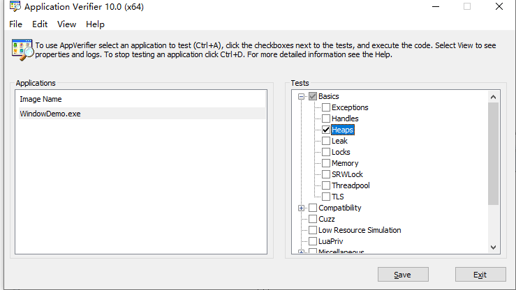

```

************* Path validation summary **************
Response                         Time (ms)     Location
Deferred                                       srv*
Symbol search path is: srv*
Executable search path is: 
ModLoad: 00007ff7`eb960000 00007ff7`eb982000   WindowDemo.exe
ModLoad: 00007ffc`e75b0000 00007ffc`e77a5000   ntdll.dll
ModLoad: 00007ffc`a46d0000 00007ffc`a4744000   C:\Windows\System32\verifier.dll
**Page heap: pid 0x66D8: page heap enabled with flags 0x3.**
AVRF: WindowDemo.exe: pid 0x66D8: flags 0x80000001: application verifier enabled
ModLoad: 00007ffc`d7be0000 00007ffc`d7c1e000   C:\Windows\SYSTEM32\vrfcore.dll
ModLoad: 00007ffc`e74b0000 00007ffc`e756e000   C:\Windows\System32\KERNEL32.DLL
ModLoad: 00007ffc`e5020000 00007ffc`e52e9000   C:\Windows\System32\KERNELBASE.dll
ModLoad: 00007ffc`e5830000 00007ffc`e59d1000   C:\Windows\System32\USER32.dll
ModLoad: 00007ffc`e4ec0000 00007ffc`e4ee2000   C:\Windows\System32\win32u.dll
ModLoad: 00007ffc`e65c0000 00007ffc`e65eb000   C:\Windows\System32\GDI32.dll
ModLoad: 00007ffc`e54f0000 00007ffc`e55fb000   C:\Windows\System32\gdi32full.dll
ModLoad: 00007ffc`e4f80000 00007ffc`e501d000   C:\Windows\System32\msvcp_win.dll
ModLoad: 00007ffc`e53f0000 00007ffc`e54f0000   C:\Windows\System32\ucrtbase.dll
ModLoad: 00007ffc`c40c0000 00007ffc`c414d000   C:\Windows\SYSTEM32\MSVCP140.dll
ModLoad: 00007ffc`d7f20000 00007ffc`d7f3a000   C:\Windows\SYSTEM32\VCRUNTIME140.dll
ModLoad: 00007ffc`e00e0000 00007ffc`e00ec000   C:\Windows\SYSTEM32\VCRUNTIME140_1.dll
(66d8.6ac8): Break instruction exception - code 80000003 (first chance)
ntdll!LdrpDoDebuggerBreak+0x30:
00007ffc`e76806b0 cc              int     3
0:000> g
ModLoad: 00007ffc`e7180000 00007ffc`e71b0000   C:\Windows\System32\IMM32.DLL
ModLoad: 00007ffc`c4860000 00007ffc`c48cb000   C:\Windows\LVUAAgentInstBaseRoot\system32\Vozokopot.dll
ModLoad: 00007ffc`e2710000 00007ffc`e27ae000   C:\Windows\system32\uxtheme.dll
ModLoad: 00007ffc`e59f0000 00007ffc`e5a8e000   C:\Windows\System32\msvcrt.dll
ModLoad: 00007ffc`e6ae0000 00007ffc`e6e35000   C:\Windows\System32\combase.dll
ModLoad: 00007ffc`e6480000 00007ffc`e65aa000   C:\Windows\System32\RPCRT4.dll
ModLoad: 00007ffc`e7390000 00007ffc`e74a5000   C:\Windows\System32\MSCTF.dll
ModLoad: 00007ffc`e5600000 00007ffc`e56cd000   C:\Windows\System32\OLEAUT32.dll
ModLoad: 00007ffc`e7230000 00007ffc`e72cb000   C:\Windows\System32\sechost.dll
ModLoad: 00007ffc`d0e50000 00007ffc`d0efc000   C:\Windows\SYSTEM32\TextShaping.dll
ModLoad: 00007ffc`a70b0000 00007ffc`a7501000   C:\Windows\LVUAAgentInstBaseRoot\system32\MozartBreathCore.dll
ModLoad: 00007ffc`e65f0000 00007ffc`e665b000   C:\Windows\System32\WS2_32.dll
ModLoad: 00007ffc`e63a0000 00007ffc`e647a000   C:\Windows\System32\COMDLG32.dll
ModLoad: 00007ffc`e2200000 00007ffc`e2214000   C:\Windows\SYSTEM32\WTSAPI32.dll
ModLoad: 00007ffc`da390000 00007ffc`da3ad000   C:\Windows\SYSTEM32\MPR.dll
ModLoad: 00007ffc`e4120000 00007ffc`e415b000   C:\Windows\SYSTEM32\IPHLPAPI.DLL
ModLoad: 00007ffc`e62f0000 00007ffc`e639d000   C:\Windows\System32\shcore.dll
ModLoad: 00007ffc`e6e40000 00007ffc`e6e95000   C:\Windows\System32\SHLWAPI.dll
ModLoad: 00007ffc`e4160000 00007ffc`e422c000   C:\Windows\SYSTEM32\DNSAPI.dll
ModLoad: 00007ffc`cb4e0000 00007ffc`cb575000   C:\Windows\SYSTEM32\WINSPOOL.DRV
ModLoad: 00007ffc`e5a90000 00007ffc`e61cf000   C:\Windows\System32\SHELL32.dll
ModLoad: 00007ffc`cdad0000 00007ffc`cdd6a000   C:\Windows\WinSxS\amd64_microsoft.windows.common-controls_6595b64144ccf1df_6.0.19041.1110_none_60b5254171f9507e\COMCTL32.dll
ModLoad: 00007ffc`e5780000 00007ffc`e582c000   C:\Windows\System32\ADVAPI32.dll
ModLoad: 00007ffc`e7050000 00007ffc`e717a000   C:\Windows\System32\ole32.dll
ModLoad: 00007ffc`e59e0000 00007ffc`e59e8000   C:\Windows\System32\NSI.dll
ModLoad: 00007ffc`d7ed0000 00007ffc`d7ed9000   C:\Windows\SYSTEM32\wsock32.dll
ModLoad: 00007ffc`e2ae0000 00007ffc`e2af2000   C:\Windows\SYSTEM32\kernel.appcore.dll
ModLoad: 00007ffc`d88d0000 00007ffc`d8925000   C:\Windows\LVUAAgentInstBaseRoot\system32\MozartBreathWeb.dll
ModLoad: 00007ffc`e4ef0000 00007ffc`e4f73000   C:\Windows\System32\bcryptPrimitives.dll
ModLoad: 00007ffc`c55f0000 00007ffc`c5612000   C:\Windows\LVUAAgentInstBaseRoot\system32\MozartBreathFw.dll
ModLoad: 00007ffc`a4560000 00007ffc`a45bf000   C:\Windows\LVUAAgentInstBaseRoot\system32\MozartBreathFile.dll
ModLoad: 00007ffc`d8880000 00007ffc`d88c7000   C:\Windows\LVUAAgentInstBaseRoot\system32\MozartBreathPrint.dll
ModLoad: 00007ffc`de860000 00007ffc`de867000   C:\Windows\SYSTEM32\MSIMG32.dll
ModLoad: 00007ffc`d68e0000 00007ffc`d69d9000   C:\Windows\SYSTEM32\textinputframework.dll
ModLoad: 00007ffc`e1a50000 00007ffc`e1dae000   C:\Windows\System32\CoreUIComponents.dll
ModLoad: 00007ffc`e1f90000 00007ffc`e2082000   C:\Windows\System32\CoreMessaging.dll
ModLoad: 00007ffc`e39c0000 00007ffc`e39f3000   C:\Windows\SYSTEM32\ntmarta.dll
ModLoad: 00007ffc`e0640000 00007ffc`e0794000   C:\Windows\SYSTEM32\wintypes.dll
ModLoad: 000001b7`28de0000 000001b7`28f34000   C:\Windows\SYSTEM32\wintypes.dll
ModLoad: 000001b7`28f40000 000001b7`29094000   C:\Windows\SYSTEM32\wintypes.dll
ModLoad: 00007ffc`a4380000 00007ffc`a44ab000   C:\Windows\LVUAAgentInstBaseRoot\system32\MozartBreathProcess.dll
ModLoad: 00007ffc`a9d10000 00007ffc`a9d72000   C:\Windows\LVUAAgentInstBaseRoot\system32\MozartBreathBolo2.dll
ModLoad: 00000001`80000000 00000001`80044000   C:\Windows\LVUAAgentInstBaseRoot\system32\OverlordSpear.dll
ModLoad: 00007ffc`bf320000 00007ffc`bf349000   C:\Windows\LVUAAgentInstBaseRoot\system32\MozartBreathProtect.dll
(66d8.6ac8): Access violation - code c0000005 (first chance)
First chance exceptions are reported before any exception handling.
This exception may be expected and handled.
*** WARNING: Unable to verify checksum for WindowDemo.exe
WindowDemo!HeapCorruption+0x6e [inlined in WindowDemo!WndProc+0x1a0]:
00007ff7`eb9622a0 8902            mov     dword ptr [rdx],eax ds:000001b7`28884000=????????
0:000> g
(66d8.6ac8): Access violation - code c0000005 (!!! second chance !!!)
WindowDemo!HeapCorruption+0x6e [inlined in WindowDemo!WndProc+0x1a0]:
00007ff7`eb9622a0 8902            mov     dword ptr [rdx],eax ds:000001b7`28884000=????????
0:000> kb
 # RetAddr           : Args to Child                                                           : Call Site
00 (Inline Function) : --------`-------- --------`-------- --------`-------- --------`-------- : WindowDemo!HeapCorruption+0x6e [c:\users\4d\downloads\windowdemo\windowdemo\heapcorruption.cpp @ 9] 
01 00007ffc`e583e7e8 : ffffffff`ffffffff 000014c0`b9613433 00000000`00000001 00000000`00000000 : WindowDemo!WndProc+0x1a0 [c:\users\4d\downloads\windowdemo\windowdemo\windowdemo.cpp @ 159] 
02 00007ffc`e583e229 : 00000000`00000156 00007ff7`eb962100 00000000`00492da4 00007ffc`00000111 : USER32!UserCallWinProcCheckWow+0x2f8
03 00007ff7`eb9620b9 : 00007ff7`eb962100 00000000`08602853 00000000`0000000a 00007ff7`eb960000 : USER32!DispatchMessageWorker+0x249
04 00007ff7`eb96269e : 00000000`00000000 00000000`0000000a 00000000`00000000 00000000`00000000 : WindowDemo!wWinMain+0x1b9 [c:\users\4d\downloads\windowdemo\windowdemo\windowdemo.cpp @ 55] 
05 (Inline Function) : --------`-------- --------`-------- --------`-------- --------`-------- : WindowDemo!invoke_main+0x21 [d:\agent\_work\2\s\src\vctools\crt\vcstartup\src\startup\exe_common.inl @ 118] 
06 00007ffc`e74c7034 : 00000000`00000000 00000000`00000000 00000000`00000000 00000000`00000000 : WindowDemo!__scrt_common_main_seh+0x106 [d:\agent\_work\2\s\src\vctools\crt\vcstartup\src\startup\exe_common.inl @ 288] 
07 00007ffc`e7602651 : 00000000`00000000 00000000`00000000 00000000`00000000 00000000`00000000 : KERNEL32!BaseThreadInitThunk+0x14
08 00000000`00000000 : 00000000`00000000 00000000`00000000 00000000`00000000 00000000`00000000 : ntdll!RtlUserThreadStart+0x21
windbg> .open -a 7ff7eb9622a0
0:000> r
rax=000000000000000c rbx=000001b728883fd0 rcx=000000000000000c
rdx=000001b728884000 rsi=0000000000000000 rdi=0000000080006010
rip=00007ff7eb9622a0 rsp=0000005b370ff810 rbp=00007ff7eb967970
 r8=000000000000000c  r9=00007ffce75b0000 r10=0000005b370ff0d0
r11=0000005b370ff030 r12=0000000000000000 r13=0000000000000111
r14=0000000000000000 r15=0000000000000000
iopl=0         nv up ei ng nz ac pe cy
cs=0033  ss=002b  ds=002b  es=002b  fs=0053  gs=002b             efl=00010291
WindowDemo!HeapCorruption+0x6e [inlined in WindowDemo!WndProc+0x1a0]:
00007ff7`eb9622a0 8902            mov     dword ptr [rdx],eax ds:000001b7`28884000=????????
0:000> dd 000001b728884000
000001b7`28884000  ???????? ???????? ???????? ????????
000001b7`28884010  ???????? ???????? ???????? ????????
000001b7`28884020  ???????? ???????? ???????? ????????
000001b7`28884030  ???????? ???????? ???????? ????????
000001b7`28884040  ???????? ???????? ???????? ????????
000001b7`28884050  ???????? ???????? ???????? ????????
000001b7`28884060  ???????? ???????? ???????? ????????
000001b7`28884070  ???????? ???????? ???????? ????????
windbg> .open -a 7ff7eb9622a0

```

### 9. 栈溢出
每个线程默认为栈空间为1MB,当耗尽时就会触发栈溢出
发生的场景可能：
1. 无限递归
2. 过度使用动态分配的栈空间，如果c函数_alloca(A2W内部就是调用了它)

错误码：Stack overflow - code c00000fd
可键入：kf 查看那个函数总消耗的栈大小

```
void StackOverrun()
{
	USES_CONVERSION;
	for (int i = 0; i < 1000000; ++i)
	{
		wprintf(L"%s: %d", A2W("test"), i);
	}
}
```

```

Microsoft (R) Windows Debugger Version 10.0.19041.1 X86
Copyright (c) Microsoft Corporation. All rights reserved.

CommandLine: C:\Users\wenxinzhou\Desktop\demo\WindowDemo\Release\WindowDemo.exe

************* Path validation summary **************
Response                         Time (ms)     Location
Deferred                                       srv*
Symbol search path is: srv*
Executable search path is: 
ModLoad: 00730000 0074f000   WindowDemo.exe
ModLoad: 77630000 777ca000   ntdll.dll
Page heap: pid 0x348: page heap enabled with flags 0x3.
AVRF: WindowDemo.exe: pid 0x348: flags 0x81643027: application verifier enabled
ModLoad: 7b690000 7b6f3000   C:\Windows\SysWOW64\verifier.dll
Page heap: pid 0x348: page heap enabled with flags 0x3.
AVRF: WindowDemo.exe: pid 0x348: flags 0x81643027: application verifier enabled
ModLoad: 7bb20000 7bb54000   C:\Windows\SysWOW64\vrfcore.dll
ModLoad: 7b160000 7b1c1000   C:\Windows\SysWOW64\vfbasics.dll
ModLoad: 757a0000 75880000   C:\Windows\SysWOW64\KERNEL32.DLL
ModLoad: 758c0000 75abf000   C:\Windows\SysWOW64\KERNELBASE.dll
ModLoad: 76f70000 77108000   C:\Windows\SysWOW64\USER32.dll
ModLoad: 75ad0000 75ae7000   C:\Windows\SysWOW64\win32u.dll
ModLoad: 75610000 75631000   C:\Windows\SysWOW64\GDI32.dll
ModLoad: 75d00000 75e5d000   C:\Windows\SysWOW64\gdi32full.dll
ModLoad: 752a0000 7531c000   C:\Windows\SysWOW64\msvcp_win.dll
ModLoad: 75f90000 760b0000   C:\Windows\SysWOW64\ucrtbase.dll
ModLoad: 6ef60000 6efcd000   C:\Windows\SysWOW64\MSVCP140.dll
ModLoad: 73c40000 73c54000   C:\Windows\SysWOW64\VCRUNTIME140.dll
(348.3b20): Break instruction exception - code 80000003 (first chance)
eax=00000000 ebx=00e1c000 ecx=186e0000 edx=00000000 esi=05cdaab8 edi=7763687c
eip=776ded22 esp=010ff35c ebp=010ff388 iopl=0         nv up ei pl zr na pe nc
cs=0023  ss=002b  ds=002b  es=002b  fs=0053  gs=002b             efl=00000246
ntdll!LdrpDoDebuggerBreak+0x2b:
776ded22 cc              int     3
0:000> g
ModLoad: 75e80000 75ea5000   C:\Windows\SysWOW64\IMM32.DLL
ModLoad: 6c140000 6c1ba000   C:\Windows\SysWOW64\uxtheme.dll
ModLoad: 75380000 7543f000   C:\Windows\SysWOW64\msvcrt.dll
ModLoad: 74eb0000 75127000   C:\Windows\SysWOW64\combase.dll
ModLoad: 77560000 7761b000   C:\Windows\SysWOW64\RPCRT4.dll
ModLoad: 74df0000 74e10000   C:\Windows\SysWOW64\SspiCli.dll
ModLoad: 74de0000 74dea000   C:\Windows\SysWOW64\CRYPTBASE.dll
ModLoad: 75320000 75380000   C:\Windows\SysWOW64\bcryptPrimitives.dll
ModLoad: 75f10000 75f86000   C:\Windows\SysWOW64\sechost.dll
ModLoad: 754a0000 755a3000   C:\Windows\SysWOW64\MSCTF.dll
ModLoad: 75af0000 75b82000   C:\Windows\SysWOW64\OLEAUT32.dll
ModLoad: 760b0000 76129000   C:\Windows\SysWOW64\ADVAPI32.dll
ModLoad: 7b530000 7b559000   C:\Program Files (x86)\Microsoft Visual Studio\2019\Enterprise\Common7\Tools\SPYXXHK.DLL
ModLoad: 74e10000 74e1f000   C:\Windows\SysWOW64\kernel.appcore.dll
ModLoad: 64410000 64492000   C:\Windows\SysWOW64\TextInputFramework.dll
ModLoad: 6a5b0000 6a80e000   C:\Windows\SysWOW64\CoreUIComponents.dll
ModLoad: 6a810000 6a899000   C:\Windows\SysWOW64\CoreMessaging.dll
ModLoad: 74e20000 74ea4000   C:\Windows\SysWOW64\SHCORE.dll
ModLoad: 71770000 71799000   C:\Windows\SysWOW64\ntmarta.dll
ModLoad: 6ca30000 6cb07000   C:\Windows\SysWOW64\wintypes.dll
ModLoad: 72aa0000 72cca000   C:\Windows\SysWOW64\iertutil.dll
(348.3b20): Stack overflow - code c00000fd (first chance)
First chance exceptions are reported before any exception handling.
This exception may be expected and handled.
eax=01003058 ebx=010036a0 ecx=00000074 edx=010035a0 esi=010036a8 edi=760a0318
eip=75fbbd4c esp=01003000 ebp=0100302c iopl=0         nv up ei pl nz na po nc
cs=0023  ss=002b  ds=002b  es=002b  fs=0053  gs=002b             efl=00010202
ucrtbase!_wctomb_s_l+0xc:
75fbbd4c 56              push    esi
0:000> g
(348.3b20): Stack overflow - code c00000fd (!!! second chance !!!)
eax=01003058 ebx=010036a0 ecx=00000074 edx=010035a0 esi=010036a8 edi=760a0318
eip=75fbbd4c esp=01003000 ebp=0100302c iopl=0         nv up ei pl nz na po nc
cs=0023  ss=002b  ds=002b  es=002b  fs=0053  gs=002b             efl=00010202
ucrtbase!_wctomb_s_l+0xc:
75fbbd4c 56              push    esi
0:000> kf
 #   Memory  ChildEBP RetAddr  
00           0100302c 75fbbcba ucrtbase!_wctomb_s_l+0xc
01        3c 01003068 75fb698b ucrtbase!_fputwc_nolock+0xda
02        28 01003090 75fb2396 ucrtbase!__crt_stdio_output::output_adapter_common<wchar_t,__crt_stdio_output::stream_output_adapter<wchar_t> >::write_string_impl+0x61
03        2c 010030bc 75fb6849 ucrtbase!__crt_stdio_output::output_processor<wchar_t,__crt_stdio_output::stream_output_adapter<wchar_t>,__crt_stdio_output::standard_base<wchar_t,__crt_stdio_output::stream_output_adapter<wchar_t> > >::write_stored_string_tchar+0x2f
04        3c 010030f8 75fb6638 ucrtbase!__crt_stdio_output::output_processor<wchar_t,__crt_stdio_output::stream_output_adapter<wchar_t>,__crt_stdio_output::standard_base<wchar_t,__crt_stdio_output::stream_output_adapter<wchar_t> > >::state_case_type+0x123
05        20 01003118 75fb52c1 ucrtbase!__crt_stdio_output::output_processor<wchar_t,__crt_stdio_output::stream_output_adapter<wchar_t>,__crt_stdio_output::standard_base<wchar_t,__crt_stdio_output::stream_output_adapter<wchar_t> > >::process+0x21a
06       4a4 010035bc 75fb51f7 ucrtbase!<lambda_be68057ced330f874c40fe9612235e36>::operator()+0x95
07        34 010035f0 75fb51c7 ucrtbase!__crt_seh_guarded_call<int>::operator()<<lambda_9b2bd5c6bb91c5c032542faa5c3cb611>,<lambda_be68057ced330f874c40fe9612235e36> &,<lambda_dbd837d1c0b7fc6e2d81c287c81c071b> >+0x2b
08        44 01003634 75fb516c ucrtbase!common_vfprintf<__crt_stdio_output::standard_base,wchar_t>+0x56
*** WARNING: Unable to verify checksum for WindowDemo.exe
09        18 0100364c 00731875 ucrtbase!__stdio_common_vfwprintf+0x1c
0a        20 0100366c 007318a7 WindowDemo!_vfwprintf_l+0x25 [C:\Program Files (x86)\Windows Kits\10\Include\10.0.19041.0\ucrt\corecrt_wstdio.h @ 309] 
0b        20 0100368c 0073198f WindowDemo!wprintf+0x27 [C:\Program Files (x86)\Windows Kits\10\Include\10.0.19041.0\ucrt\corecrt_wstdio.h @ 618] 
0c     fbfb8 010ff644 00731c52 WindowDemo!StackOverrun+0xcf [C:\Users\wenxinzhou\Desktop\demo\WindowDemo\WindowDemo\StackOverrun.cpp @ 9] 
0d        5c 010ff6a0 76fb47ab WindowDemo!WndProc+0xd2 [C:\Users\wenxinzhou\Desktop\demo\WindowDemo\WindowDemo\WindowDemo.cpp @ 160] 
0e        2c 010ff6cc 76f952ac USER32!_InternalCallWinProc+0x2b
0f        e4 010ff7b0 76f943fe USER32!UserCallWinProcCheckWow+0x3ac
10        74 010ff824 76f941e0 USER32!DispatchMessageWorker+0x20e
11         c 010ff830 00731a57 USER32!DispatchMessageW+0x10
12        30 010ff860 00731f5a WindowDemo!wWinMain+0xa7 [C:\Users\wenxinzhou\Desktop\demo\WindowDemo\WindowDemo\WindowDemo.cpp @ 59] 
13        4c (Inline) -------- WindowDemo!invoke_main+0x1a [d:\a01\_work\2\s\src\vctools\crt\vcstartup\src\startup\exe_common.inl @ 118] 
14         0 010ff8ac 757b6359 WindowDemo!__scrt_common_main_seh+0xf8 [d:\a01\_work\2\s\src\vctools\crt\vcstartup\src\startup\exe_common.inl @ 288] 
15        10 010ff8bc 776987a4 KERNEL32!BaseThreadInitThunk+0x19
16        5c 010ff918 77698774 ntdll!__RtlUserThreadStart+0x2f
17        10 010ff928 00000000 ntdll!_RtlUserThreadStart+0x1b
windbg> .open -a 73198f

```

### 10. 死锁
```
!locks
```
```
*** wait with pending attach

************* Path validation summary **************
Response                         Time (ms)     Location
Deferred                                       srv*
Symbol search path is: srv*
Executable search path is: 
ModLoad: 00960000 00981000   C:\Users\wenxinzhou\Desktop\demo\WindowDemo\Release\WindowDemo.exe
ModLoad: 77630000 777ca000   C:\Windows\SYSTEM32\ntdll.dll
ModLoad: 7b690000 7b6f3000   C:\Windows\SysWOW64\verifier.dll
ModLoad: 7c090000 7c0c4000   C:\Windows\SYSTEM32\vrfcore.dll
ModLoad: 7b160000 7b1c1000   C:\Windows\SYSTEM32\vfbasics.dll
ModLoad: 757a0000 75880000   C:\Windows\System32\KERNEL32.DLL
ModLoad: 758c0000 75abf000   C:\Windows\System32\KERNELBASE.dll
ModLoad: 76f70000 77108000   C:\Windows\System32\USER32.dll
ModLoad: 75ad0000 75ae7000   C:\Windows\System32\win32u.dll
ModLoad: 75610000 75631000   C:\Windows\System32\GDI32.dll
ModLoad: 75d00000 75e5d000   C:\Windows\System32\gdi32full.dll
ModLoad: 752a0000 7531c000   C:\Windows\System32\msvcp_win.dll
ModLoad: 75f90000 760b0000   C:\Windows\System32\ucrtbase.dll
ModLoad: 6ef60000 6efcd000   C:\Windows\SYSTEM32\MSVCP140.dll
ModLoad: 73c40000 73c54000   C:\Windows\SYSTEM32\VCRUNTIME140.dll
ModLoad: 75e80000 75ea5000   C:\Windows\System32\IMM32.DLL
ModLoad: 6c140000 6c1ba000   C:\Windows\system32\uxtheme.dll
ModLoad: 75380000 7543f000   C:\Windows\System32\msvcrt.dll
ModLoad: 74eb0000 75127000   C:\Windows\System32\combase.dll
ModLoad: 77560000 7761b000   C:\Windows\System32\RPCRT4.dll
ModLoad: 74df0000 74e10000   C:\Windows\System32\SspiCli.dll
ModLoad: 74de0000 74dea000   C:\Windows\System32\CRYPTBASE.dll
ModLoad: 75320000 75380000   C:\Windows\System32\bcryptPrimitives.dll
ModLoad: 75f10000 75f86000   C:\Windows\System32\sechost.dll
ModLoad: 754a0000 755a3000   C:\Windows\System32\MSCTF.dll
ModLoad: 75af0000 75b82000   C:\Windows\System32\OLEAUT32.dll
ModLoad: 760b0000 76129000   C:\Windows\System32\ADVAPI32.dll
ModLoad: 7b530000 7b559000   C:\Program Files (x86)\Microsoft Visual Studio\2019\Enterprise\Common7\Tools\SPYXXHK.DLL
ModLoad: 74e10000 74e1f000   C:\Windows\System32\kernel.appcore.dll
ModLoad: 64410000 64492000   C:\Windows\System32\TextInputFramework.dll
ModLoad: 6a5b0000 6a80e000   C:\Windows\System32\CoreUIComponents.dll
ModLoad: 6a810000 6a899000   C:\Windows\System32\CoreMessaging.dll
ModLoad: 74e20000 74ea4000   C:\Windows\System32\SHCORE.dll
ModLoad: 71770000 71799000   C:\Windows\SYSTEM32\ntmarta.dll
ModLoad: 6ca30000 6cb07000   C:\Windows\SYSTEM32\wintypes.dll
ModLoad: 72aa0000 72cca000   C:\Windows\System32\iertutil.dll
(4884.6b30): Break instruction exception - code 80000003 (first chance)
eax=01181000 ebx=00000000 ecx=776daf30 edx=776daf30 esi=776daf30 edi=776daf30
eip=776a5040 esp=0baffd1c ebp=0baffd48 iopl=0         nv up ei pl zr na pe nc
cs=0023  ss=002b  ds=002b  es=002b  fs=0053  gs=002b             efl=00000246
ntdll!DbgBreakPoint:
776a5040 cc              int     3
0:006> ~*kb

   0  Id: 4884.3218 Suspend: 1 Teb: 0116f000 Unfrozen
 # ChildEBP RetAddr  Args to Child              
00 0135f730 7b177df0 000000d0 00000000 00000000 ntdll!NtWaitForSingleObject+0xc
01 0135f744 759bf369 000000d0 00000000 00000000 vfbasics!AVrfpNtWaitForSingleObject+0x20
02 0135f7b8 7b177c23 000000d0 ffffffff 00000000 KERNELBASE!WaitForSingleObjectEx+0x99
03 0135f7d8 7b177c9b 00000000 7b198e80 757c3ef0 vfbasics!AVrfpWaitForSingleObjectExCommon+0xa1
04 0135f7f0 7b177c23 000000d0 ffffffff 00000000 vfbasics!AVrfpKernelbaseWaitForSingleObjectEx+0x1b
05 0135f810 7b177c75 00000000 7b1827d8 000000d0 vfbasics!AVrfpWaitForSingleObjectExCommon+0xa1
06 0135f828 6ef755a1 000000d0 ffffffff 00000000 vfbasics!AVrfpKernel32WaitForSingleObjectEx+0x25
*** WARNING: Unable to verify checksum for C:\Users\wenxinzhou\Desktop\demo\WindowDemo\Release\WindowDemo.exe
07 0135f840 009612d8 000000d0 00001e98 00000000 MSVCP140!_Thrd_join+0x11 [d:\a01\_work\2\s\src\vctools\crt\github\stl\src\cthread.cpp @ 57] 
08 0135f860 00961481 6979aaee 000000d0 00001e98 WindowDemo!std::thread::join+0x48 [C:\Program Files (x86)\Microsoft Visual Studio\2019\Enterprise\VC\Tools\MSVC\14.29.30133\include\thread @ 130] 
09 0135f8f0 00963680 00000034 00008009 00000111 WindowDemo!DeadLock+0x71 [C:\Users\wenxinzhou\Desktop\demo\WindowDemo\WindowDemo\DeadLock.cpp @ 54] 
0a 0135f94c 76fb47ab 000615da 00000111 00008009 WindowDemo!WndProc+0xe0 [C:\Users\wenxinzhou\Desktop\demo\WindowDemo\WindowDemo\WindowDemo.cpp @ 168] 
0b 0135f978 76f952ac 009635a0 000615da 00000111 USER32!_InternalCallWinProc+0x2b
0c 0135fa5c 76f943fe 009635a0 00000000 00000111 USER32!UserCallWinProcCheckWow+0x3ac
0d 0135fad0 76f941e0 00000111 0135fb0c 00963477 USER32!DispatchMessageWorker+0x20e
0e 0135fadc 00963477 0135faec 3434014f 000615da USER32!DispatchMessageW+0x10
0f 0135fb0c 0096398a 00960000 00000000 05ffbc64 WindowDemo!wWinMain+0xa7 [C:\Users\wenxinzhou\Desktop\demo\WindowDemo\WindowDemo\WindowDemo.cpp @ 61] 
10 (Inline) -------- -------- -------- -------- WindowDemo!invoke_main+0x1a [d:\a01\_work\2\s\src\vctools\crt\vcstartup\src\startup\exe_common.inl @ 118] 
11 0135fb58 757b6359 0116c000 757b6340 0135fbc4 WindowDemo!__scrt_common_main_seh+0xf8 [d:\a01\_work\2\s\src\vctools\crt\vcstartup\src\startup\exe_common.inl @ 288] 
12 0135fb68 776987a4 0116c000 1a8abfe4 00000000 KERNEL32!BaseThreadInitThunk+0x19
13 0135fbc4 77698774 ffffffff 776ba133 00000000 ntdll!__RtlUserThreadStart+0x2f
14 0135fbd4 00000000 00963a0e 0116c000 00000000 ntdll!_RtlUserThreadStart+0x1b

   1  Id: 4884.53dc Suspend: 1 Teb: 01172000 Unfrozen
 # ChildEBP RetAddr  Args to Child              
00 08d9f944 776682bf 00000280 08a7ae30 00000010 ntdll!NtWaitForWorkViaWorkerFactory+0xc
01 08d9fb00 757b6359 08a46ee0 757b6340 08d9fb6c ntdll!TppWorkerThread+0x33f
02 08d9fb10 776987a4 08a46ee0 1366bf4c 00000000 KERNEL32!BaseThreadInitThunk+0x19
03 08d9fb6c 77698774 ffffffff 776ba133 00000000 ntdll!__RtlUserThreadStart+0x2f
04 08d9fb7c 00000000 77667f80 08a46ee0 00000000 ntdll!_RtlUserThreadStart+0x1b

   2  Id: 4884.2484 Suspend: 1 Teb: 01175000 Unfrozen
 # ChildEBP RetAddr  Args to Child              
00 08e9f780 776682bf 00000280 08bc0e30 00000010 ntdll!NtWaitForWorkViaWorkerFactory+0xc
01 08e9f93c 757b6359 08a46ee0 757b6340 08e9f9a8 ntdll!TppWorkerThread+0x33f
02 08e9f94c 776987a4 08a46ee0 1356bd88 00000000 KERNEL32!BaseThreadInitThunk+0x19
03 08e9f9a8 77698774 ffffffff 776ba133 00000000 ntdll!__RtlUserThreadStart+0x2f
04 08e9f9b8 00000000 77667f80 08a46ee0 00000000 ntdll!_RtlUserThreadStart+0x1b

   3  Id: 4884.1754 Suspend: 1 Teb: 01178000 Unfrozen
 # ChildEBP RetAddr  Args to Child              
00 08fdf928 776682bf 00000280 08bd6e30 00000010 ntdll!NtWaitForWorkViaWorkerFactory+0xc
01 08fdfae4 757b6359 08a46ee0 757b6340 08fdfb50 ntdll!TppWorkerThread+0x33f
02 08fdfaf4 776987a4 08a46ee0 1342bf70 00000000 KERNEL32!BaseThreadInitThunk+0x19
03 08fdfb50 77698774 ffffffff 776ba133 00000000 ntdll!__RtlUserThreadStart+0x2f
04 08fdfb60 00000000 77667f80 08a46ee0 00000000 ntdll!_RtlUserThreadStart+0x1b

   4  Id: 4884.1e98 Suspend: 1 Teb: 0117b000 Unfrozen
 # ChildEBP RetAddr  Args to Child              
00 0b87fa30 7768b5fb 00967414 00000000 00967410 ntdll!NtWaitForAlertByThreadId+0xc
01 0b87fa68 7768b2cd 00000000 00000000 00967414 ntdll!RtlpWaitOnAddressWithTimeout+0xc0
02 0b87fb08 7767d4e1 00006a0c 00967410 0117b000 ntdll!RtlpWaitOnCriticalSection+0x18d
03 0b87fb40 7767ac69 0b87fb60 7b16970f 00967410 ntdll!RtlpEnterCriticalSectionContended+0x261
04 0b87fb48 7b16970f 00967410 108fefe8 00961dc0 ntdll!RtlEnterCriticalSection+0x49
05 0b87fb60 7b1697c6 0b87fb7c 00961372 00967410 vfbasics!AVrfpRtlEnterCriticalSection2+0x4f
06 0b87fb68 00961372 00967410 0000000a 00000000 vfbasics!AVrfpRtlEnterCriticalSection+0x26
07 0b87fb7c 0096222a 0b87fbb0 00961e24 108fcff8 WindowDemo!fun1+0x42 [C:\Users\wenxinzhou\Desktop\demo\WindowDemo\WindowDemo\DeadLock.cpp @ 23] 
08 0b87fb84 00961e24 108fcff8 63cba9ae 00080001 WindowDemo!std::invoke<void (__cdecl*)(void)>+0xa [C:\Program Files (x86)\Microsoft Visual Studio\2019\Enterprise\VC\Tools\MSVC\14.29.30133\include\type_traits @ 1586] 
09 0b87fbb0 75fd38df 108fcff8 05d92985 7b175c20 WindowDemo!std::thread::_Invoke<std::tuple<void (__cdecl*)(void)>,0>+0x64 [C:\Program Files (x86)\Microsoft Visual Studio\2019\Enterprise\VC\Tools\MSVC\14.29.30133\include\thread @ 55] 
0a 0b87fbe8 7b175c68 108fefe8 7e12c30b 7b175c20 ucrtbase!thread_start<unsigned int (__stdcall*)(void *),1>+0x3f
0b 0b87fc20 757b6359 0b1b4fe0 757b6340 0b87fc8c vfbasics!AVrfpStandardThreadFunction+0x48
0c 0b87fc30 776987a4 0b1b4fe0 1038b8ac 00000000 KERNEL32!BaseThreadInitThunk+0x19
0d 0b87fc8c 77698774 ffffffff 776ba133 00000000 ntdll!__RtlUserThreadStart+0x2f
0e 0b87fc9c 00000000 7b175c20 0b1b4fe0 00000000 ntdll!_RtlUserThreadStart+0x1b

   5  Id: 4884.6a0c Suspend: 1 Teb: 0117e000 Unfrozen
 # ChildEBP RetAddr  Args to Child              
00 0b9bf718 7768b5fb 00967430 00000000 0096742c ntdll!NtWaitForAlertByThreadId+0xc
01 0b9bf750 7768b2cd 00000000 00000000 00967430 ntdll!RtlpWaitOnAddressWithTimeout+0xc0
02 0b9bf7f0 7767d4e1 00001e98 0096742c 0117e000 ntdll!RtlpWaitOnCriticalSection+0x18d
03 0b9bf828 7767ac69 0b9bf848 7b16970f 0096742c ntdll!RtlpEnterCriticalSectionContended+0x261
04 0b9bf830 7b16970f 0096742c 10902fe8 00961dc0 ntdll!RtlEnterCriticalSection+0x49
05 0b9bf848 7b1697c6 0b9bf864 009613e2 0096742c vfbasics!AVrfpRtlEnterCriticalSection2+0x4f
06 0b9bf850 009613e2 0096742c 0000000a 00000000 vfbasics!AVrfpRtlEnterCriticalSection+0x26
07 0b9bf864 0096222a 0b9bf898 00961e24 10900ff8 WindowDemo!fun2+0x42 [C:\Users\wenxinzhou\Desktop\demo\WindowDemo\WindowDemo\DeadLock.cpp @ 39] 
08 0b9bf86c 00961e24 10900ff8 63d7aa86 1024bc48 WindowDemo!std::invoke<void (__cdecl*)(void)>+0xa [C:\Program Files (x86)\Microsoft Visual Studio\2019\Enterprise\VC\Tools\MSVC\14.29.30133\include\type_traits @ 1586] 
09 0b9bf898 75fd38df 10900ff8 05c52abd 7b175c20 WindowDemo!std::thread::_Invoke<std::tuple<void (__cdecl*)(void)>,0>+0x64 [C:\Program Files (x86)\Microsoft Visual Studio\2019\Enterprise\VC\Tools\MSVC\14.29.30133\include\thread @ 55] 
0a 0b9bf8d0 7b175c68 10902fe8 7e0ec623 7b175c20 ucrtbase!thread_start<unsigned int (__stdcall*)(void *),1>+0x3f
0b 0b9bf908 757b6359 0b1b6fe0 757b6340 0b9bf974 vfbasics!AVrfpStandardThreadFunction+0x48
0c 0b9bf918 776987a4 0b1b6fe0 1024bd54 00000000 KERNEL32!BaseThreadInitThunk+0x19
0d 0b9bf974 77698774 ffffffff 776ba133 00000000 ntdll!__RtlUserThreadStart+0x2f
0e 0b9bf984 00000000 7b175c20 0b1b6fe0 00000000 ntdll!_RtlUserThreadStart+0x1b

#  6  Id: 4884.6b30 Suspend: 1 Teb: 01181000 Unfrozen
 # ChildEBP RetAddr  Args to Child              
00 0baffd18 776daf69 1010b968 776daf30 776daf30 ntdll!DbgBreakPoint
01 0baffd48 757b6359 00000000 757b6340 0baffdb4 ntdll!DbgUiRemoteBreakin+0x39
02 0baffd58 776987a4 00000000 1010b994 00000000 KERNEL32!BaseThreadInitThunk+0x19
03 0baffdb4 77698774 ffffffff 776ba133 00000000 ntdll!__RtlUserThreadStart+0x2f
04 0baffdc4 00000000 776daf30 00000000 00000000 ntdll!_RtlUserThreadStart+0x1b
0:006> !locks

CritSec WindowDemo!m1+0 at 0096742c
WaiterWoken        No
LockCount          1
RecursionCount     1
OwningThread       1e98
EntryCount         0
ContentionCount    1
*** Locked

CritSec WindowDemo!m2+0 at 00967410
WaiterWoken        No
LockCount          1
RecursionCount     1
OwningThread       6a0c
EntryCount         0
ContentionCount    1
*** Locked

Scanned 311 critical sections
0:006> ~~[1e98]
   4  Id: 4884.1e98 Suspend: 1 Teb: 0117b000 Unfrozen
      Start: vfbasics!AVrfpStandardThreadFunction (7b175c20)
      Priority: 0  Priority class: 32  Affinity: ffff

```

### 11. 内存泄漏

```
命令行运行gflags 启动对应待分析应用的用户态栈追踪
C:\Program Files (x86)\Windows Kits\10\Debuggers\x86>gflags.exe /i WindowDemo.exe +ust
Current Registry Settings for WindowDemo.exe executable are: 00001000
    ust - Create user mode stack trace database

// 附加到进程，对当前堆使用情况进行一次快照
!heap -s

// 继续运行
g 

// 运行一段时间后，再次快照, 找出对应发生增长的堆句柄 xxxx
!heap -s

// 打印出xxxx的消耗情况，找到可疑的块以及大小yyy
!heap -stat -h xxxx

// 随意找到分配一个大小为yyy的地址zzz
!heap -flt s yyy

// 查看其对应的调用堆栈
!heap -p -a zzz
```

```

Microsoft (R) Windows Debugger Version 10.0.19041.1 X86
Copyright (c) Microsoft Corporation. All rights reserved.

*** wait with pending attach

************* Path validation summary **************
Response                         Time (ms)     Location
Deferred                                       srv*
Symbol search path is: srv*
Executable search path is: 
ModLoad: 007a0000 007c1000   C:\Users\wenxinzhou\Desktop\demo\WindowDemo\Release\WindowDemo.exe
ModLoad: 77630000 777ca000   C:\Windows\SYSTEM32\ntdll.dll
ModLoad: 757a0000 75880000   C:\Windows\System32\KERNEL32.DLL
ModLoad: 758c0000 75abf000   C:\Windows\System32\KERNELBASE.dll
ModLoad: 76f70000 77108000   C:\Windows\System32\USER32.dll
ModLoad: 75ad0000 75ae7000   C:\Windows\System32\win32u.dll
ModLoad: 75610000 75631000   C:\Windows\System32\GDI32.dll
ModLoad: 75d00000 75e5d000   C:\Windows\System32\gdi32full.dll
ModLoad: 752a0000 7531c000   C:\Windows\System32\msvcp_win.dll
ModLoad: 75f90000 760b0000   C:\Windows\System32\ucrtbase.dll
ModLoad: 6ef60000 6efcd000   C:\Windows\SYSTEM32\MSVCP140.dll
ModLoad: 73c40000 73c54000   C:\Windows\SYSTEM32\VCRUNTIME140.dll
ModLoad: 75e80000 75ea5000   C:\Windows\System32\IMM32.DLL
ModLoad: 6c140000 6c1ba000   C:\Windows\system32\uxtheme.dll
ModLoad: 75380000 7543f000   C:\Windows\System32\msvcrt.dll
ModLoad: 74eb0000 75127000   C:\Windows\System32\combase.dll
ModLoad: 77560000 7761b000   C:\Windows\System32\RPCRT4.dll
ModLoad: 74df0000 74e10000   C:\Windows\System32\SspiCli.dll
ModLoad: 74de0000 74dea000   C:\Windows\System32\CRYPTBASE.dll
ModLoad: 75320000 75380000   C:\Windows\System32\bcryptPrimitives.dll
ModLoad: 75f10000 75f86000   C:\Windows\System32\sechost.dll
ModLoad: 754a0000 755a3000   C:\Windows\System32\MSCTF.dll
ModLoad: 75af0000 75b82000   C:\Windows\System32\OLEAUT32.dll
ModLoad: 760b0000 76129000   C:\Windows\System32\ADVAPI32.dll
ModLoad: 7b530000 7b559000   C:\Program Files (x86)\Microsoft Visual Studio\2019\Enterprise\Common7\Tools\SPYXXHK.DLL
ModLoad: 74e10000 74e1f000   C:\Windows\System32\kernel.appcore.dll
ModLoad: 64410000 64492000   C:\Windows\System32\TextInputFramework.dll
ModLoad: 6a5b0000 6a80e000   C:\Windows\System32\CoreUIComponents.dll
ModLoad: 6a810000 6a899000   C:\Windows\System32\CoreMessaging.dll
ModLoad: 74e20000 74ea4000   C:\Windows\System32\SHCORE.dll
ModLoad: 71770000 71799000   C:\Windows\SYSTEM32\ntmarta.dll
ModLoad: 6ca30000 6cb07000   C:\Windows\SYSTEM32\wintypes.dll
ModLoad: 72aa0000 72cca000   C:\Windows\System32\iertutil.dll
(d9c.82a4): Break instruction exception - code 80000003 (first chance)
eax=00c20000 ebx=00000000 ecx=776daf30 edx=776daf30 esi=776daf30 edi=776daf30
eip=776a5040 esp=05befa50 ebp=05befa7c iopl=0         nv up ei pl zr na pe nc
cs=0023  ss=002b  ds=002b  es=002b  fs=0053  gs=002b             efl=00000246
ntdll!DbgBreakPoint:
776a5040 cc              int     3
0:004> !heap -s


************************************************************************************************************************
                                              NT HEAP STATS BELOW
************************************************************************************************************************
NtGlobalFlag enables following debugging aids for new heaps:
    stack back traces
LFH Key                   : 0x9c6e4dd0
Termination on corruption : ENABLED
  Heap     Flags   Reserv  Commit  Virt   Free  List   UCR  Virt  Lock  Fast 
                    (k)     (k)    (k)     (k) length      blocks cont. heap 
-----------------------------------------------------------------------------
039d0000 08000002    4296   3644   4084     98    25     3    0      1   LFH
05680000 08001002     272     64     60      8     3     1    0      0   LFH
057a0000 08001002     272     32     60      0     8     1    0      0   LFH
-----------------------------------------------------------------------------
0:004> g
(d9c.751c): Break instruction exception - code 80000003 (first chance)
eax=00c29000 ebx=00000000 ecx=776daf30 edx=776daf30 esi=776daf30 edi=776daf30
eip=776a5040 esp=06a6f780 ebp=06a6f7ac iopl=0         nv up ei pl zr na pe nc
cs=0023  ss=002b  ds=002b  es=002b  fs=0053  gs=002b             efl=00000246
ntdll!DbgBreakPoint:
776a5040 cc              int     3
0:006> !heap -s


************************************************************************************************************************
                                              NT HEAP STATS BELOW
************************************************************************************************************************
NtGlobalFlag enables following debugging aids for new heaps:
    stack back traces
LFH Key                   : 0x9c6e4dd0
Termination on corruption : ENABLED
  Heap     Flags   Reserv  Commit  Virt   Free  List   UCR  Virt  Lock  Fast 
                    (k)     (k)    (k)     (k) length      blocks cont. heap 
-----------------------------------------------------------------------------
039d0000 08000002   16576   9548  16364    190    28     5    0      1   LFH
05680000 08001002     272     64     60      7     3     1    0      0   LFH
057a0000 08001002     272     32     60      0     8     1    0      0   LFH
-----------------------------------------------------------------------------
0:006> !heap -stat -h 039d0000
 heap @ 039d0000
group-by: TOTSIZE max-display: 20
    size     #blocks     total     ( %) (percent of total busy bytes)
    190 5328 - 81ee80  (97.61)
    4000 2 - 8000  (0.38)
    3980 1 - 3980  (0.17)
    20 15b - 2b60  (0.13)
    d0 2d - 2490  (0.11)
    2460 1 - 2460  (0.11)
    2076 1 - 2076  (0.10)
    1e40 1 - 1e40  (0.09)
    800 3 - 1800  (0.07)
    a8 24 - 17a0  (0.07)
    200 b - 1600  (0.06)
    6c8 3 - 1458  (0.06)
    400 5 - 1400  (0.06)
    10b8 1 - 10b8  (0.05)
    e00 1 - e00  (0.04)
    40 34 - d00  (0.04)
    2c 4a - cb8  (0.04)
    b94 1 - b94  (0.03)
    a88 1 - a88  (0.03)
    48 22 - 990  (0.03)
0:006> !heap -flt s 190
    _HEAP @ 39d0000
      HEAP_ENTRY Size Prev Flags    UserPtr UserSize - state
        039fb0a0 0035 0000  [00]   039fb0b8    00190 - (busy)
        039fecf8 0035 0035  [00]   039fed10    00190 - (busy)
        03a1c9f0 0035 0035  [00]   03a1ca08    00190 - (busy)
        03a1cb98 0035 0035  [00]   03a1cbb0    00190 - (busy)
        03a1cd40 0035 0035  [00]   03a1cd58    00190 - (busy)
          unknown!noop
        03a1cee8 0035 0035  [00]   03a1cf00    00190 - (busy)
        03a1d090 0035 0035  [00]   03a1d0a8    00190 - (busy)
        03a1d238 0035 0035  [00]   03a1d250    00190 - (busy)
        03a1d3e0 0035 0035  [00]   03a1d3f8    00190 - (busy)
        03a1d588 0035 0035  [00]   03a1d5a0    00190 - (busy)
          unknown!noop
        03a1d730 0035 0035  [00]   03a1d748    00190 - (busy)
        03a1d8d8 0035 0035  [00]   03a1d8f0    00190 - (busy)
        03a1da80 0035 0035  [00]   03a1da98    00190 - (busy)
        03a1dc28 0035 0035  [00]   03a1dc40    00190 - (busy)
        03a1ddd0 0035 0035  [00]   03a1dde8    00190 - (busy)
        03a1df78 0035 0035  [00]   03a1df90    00190 - (busy)
        03a1e120 0035 0035  [00]   03a1e138    00190 - (busy)
        03a1e300 0035 0035  [00]   03a1e318    00190 - (busy)
        03a1e4a8 0035 0035  [00]   03a1e4c0    00190 - (busy)
        03a1e650 0035 0035  [00]   03a1e668    00190 - (busy)
        03a1e7f8 0035 0035  [00]   03a1e810    00190 - (busy)
        03a1e9a0 0035 0035  [00]   03a1e9b8    00190 - (busy)
        03a1eb48 0035 0035  [00]   03a1eb60    00190 - (busy)
        03a1ecf0 0035 0035  [00]   03a1ed08    00190 - (busy)
        03a1ee98 0035 0035  [00]   03a1eeb0    00190 - (busy)
        03a1f040 0035 0035  [00]   03a1f058    00190 - (busy)
        03a1f318 0035 0035  [00]   03a1f330    00190 - (busy)
        03a1f4c0 0035 0035  [00]   03a1f4d8    00190 - (busy)
        03a1f668 0035 0035  [00]   03a1f680    00190 - (busy)
        03a1f810 0035 0035  [00]   03a1f828    00190 - (busy)
        03a1f9b8 0035 0035  [00]   03a1f9d0    00190 - (busy)
        03a1fb60 0035 0035  [00]   03a1fb78    00190 - (busy)
        03a1fd08 0035 0035  [00]   03a1fd20    00190 - (busy)
        03a1feb0 0035 0035  [00]   03a1fec8    00190 - (busy)
        03a20058 0035 0035  [00]   03a20070    00190 - (busy)
        03a20200 0035 0035  [00]   03a20218    00190 - (busy)
        03a203a8 0035 0035  [00]   03a203c0    00190 - (busy)
        03a20550 0035 0035  [00]   03a20568    00190 - (busy)
        03a206f8 0035 0035  [00]   03a20710    00190 - (busy)
        03a208a0 0035 0035  [00]   03a208b8    00190 - (busy)
        03a20a48 0035 0035  [00]   03a20a60    00190 - (busy)
        03a20bf0 0035 0035  [00]   03a20c08    00190 - (busy)
        03a20d98 0035 0035  [00]   03a20db0    00190 - (busy)
        03a20f40 0035 0035  [00]   03a20f58    00190 - (busy)
        03a210e8 0035 0035  [00]   03a21100    00190 - (busy)
        03a21330 0035 0035  [00]   03a21348    00190 - (busy)
        03a214d8 0035 0035  [00]   03a214f0    00190 - (busy)
        03a21680 0035 0035  [00]   03a21698    00190 - (busy)
        03a21828 0035 0035  [00]   03a21840    00190 - (busy)
        03a219d0 0035 0035  [00]   03a219e8    00190 - (busy)
        03a21b78 0035 0035  [00]   03a21b90    00190 - (busy)
        03a21d20 0035 0035  [00]   03a21d38    00190 - (busy)
        03a21ec8 0035 0035  [00]   03a21ee0    00190 - (busy)
        03a22070 0035 0035  [00]   03a22088    00190 - (busy)
        03a22218 0035 0035  [00]   03a22230    00190 - (busy)
        03a223c0 0035 0035  [00]   03a223d8    00190 - (busy)
        03a22568 0035 0035  [00]   03a22580    00190 - (busy)
        03a22710 0035 0035  [00]   03a22728    00190 - (busy)
        03a228b8 0035 0035  [00]   03a228d0    00190 - (busy)
        03a22a60 0035 0035  [00]   03a22a78    00190 - (busy)
        03a22c08 0035 0035  [00]   03a22c20    00190 - (busy)
        03a22db0 0035 0035  [00]   03a22dc8    00190 - (busy)
        03a22f58 0035 0035  [00]   03a22f70    00190 - (busy)
        03a23100 0035 0035  [00]   03a23118    00190 - (busy)
        03a23348 0035 0035  [00]   03a23360    00190 - (busy)
        03a234f0 0035 0035  [00]   03a23508    00190 - (busy)
        03a23698 0035 0035  [00]   03a236b0    00190 - (busy)
        03a23840 0035 0035  [00]   03a23858    00190 - (busy)
        03a239e8 0035 0035  [00]   03a23a00    00190 - (busy)
        03a23b90 0035 0035  [00]   03a23ba8    00190 - (busy)
        03a23d38 0035 0035  [00]   03a23d50    00190 - (busy)
        03a23ee0 0035 0035  [00]   03a23ef8    00190 - (busy)
        03a24088 0035 0035  [00]   03a240a0    00190 - (busy)
        03a24230 0035 0035  [00]   03a24248    00190 - (busy)
        03a243d8 0035 0035  [00]   03a243f0    00190 - (busy)
        03a24580 0035 0035  [00]   03a24598    00190 - (busy)
        03a24728 0035 0035  [00]   03a24740    00190 - (busy)
        03a248d0 0035 0035  [00]   03a248e8    00190 - (busy)
        03a24a78 0035 0035  [00]   03a24a90    00190 - (busy)
        03a24c20 0035 0035  [00]   03a24c38    00190 - (busy)
        03a24dc8 0035 0035  [00]   03a24de0    00190 - (busy)
        03a24f70 0035 0035  [00]   03a24f88    00190 - (busy)
        03a25118 0035 0035  [00]   03a25130    00190 - (busy)
        03a25360 0035 0035  [00]   03a25378    00190 - (busy)
        03a25508 0035 0035  [00]   03a25520    00190 - (busy)
        03a256b0 0035 0035  [00]   03a256c8    00190 - (busy)
        03a25858 0035 0035  [00]   03a25870    00190 - (busy)
        03a25a00 0035 0035  [00]   03a25a18    00190 - (busy)
        03a25ba8 0035 0035  [00]   03a25bc0    00190 - (busy)
        03a25d50 0035 0035  [00]   03a25d68    00190 - (busy)
        03a25ef8 0035 0035  [00]   03a25f10    00190 - (busy)
        03a260a0 0035 0035  [00]   03a260b8    00190 - (busy)
        03a26248 0035 0035  [00]   03a26260    00190 - (busy)
        03a263f0 0035 0035  [00]   03a26408    00190 - (busy)
        0597b1b0 0035 0035  [00]   0597b1c8    00190 - (busy)
        0597b358 0035 0035  [00]   0597b370    00190 - (busy)
        0597b500 0035 0035  [00]   0597b518    00190 - (busy)
        0597b6a8 0035 0035  [00]   0597b6c0    00190 - (busy)
        0597b850 0035 0035  [00]   0597b868    00190 - (busy)
        062f0ee0 0035 0035  [00]   062f0ef8    00190 - (busy)
        .........
    _HEAP @ 5680000
    _HEAP @ 57a0000
 
0:006> !heap -p -a 057bdd28
    address 057bdd28 found in
    _HEAP @ 39d0000
      HEAP_ENTRY Size Prev Flags    UserPtr UserSize - state
        057bdd10 0035 0000  [00]   057bdd28    00190 - (busy)
        77703774 ntdll!RtlpCallInterceptRoutine+0x00000026
        77680856 ntdll!RtlpAllocateHeapInternal+0x00001096
        7767f7ae ntdll!RtlAllocateHeap+0x0000003e
        75fbede6 ucrtbase!_malloc_base+0x00000026
        7a37f4 WindowDemo!operator new+0x0000001a
        7a3220 WindowDemo!doLeak+0x00000010
        7a3241 WindowDemo!MemoryLeak+0x00000011
        7a36c7 WindowDemo!WndProc+0x000000e7
        76fb47ab USER32!_InternalCallWinProc+0x0000002b
        76f952ac USER32!UserCallWinProcCheckWow+0x000003ac
        76f943fe USER32!DispatchMessageWorker+0x0000020e
        76f941e0 USER32!DispatchMessageW+0x00000010
        7a34b7 WindowDemo!wWinMain+0x000000a7
        7a39e3 WindowDemo!__scrt_common_main_seh+0x000000f8
        757b6359 KERNEL32!BaseThreadInitThunk+0x00000019
        776987a4 ntdll!__RtlUserThreadStart+0x0000002f
        77698774 ntdll!_RtlUserThreadStart+0x0000001b

 
```

# 站在巨人的肩膀上
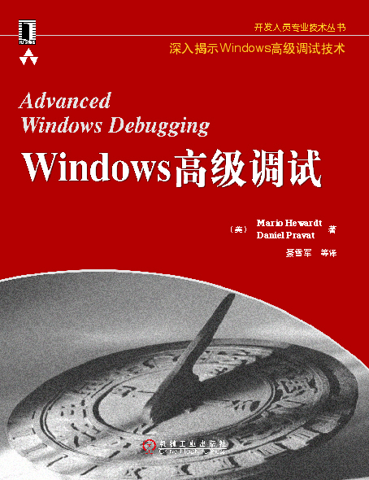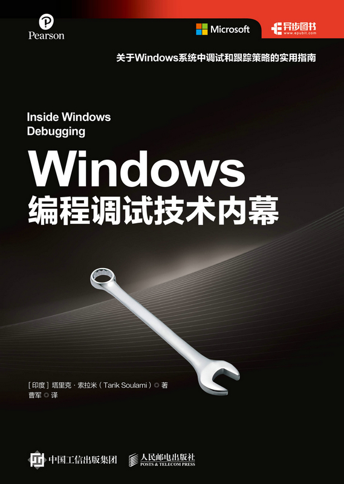