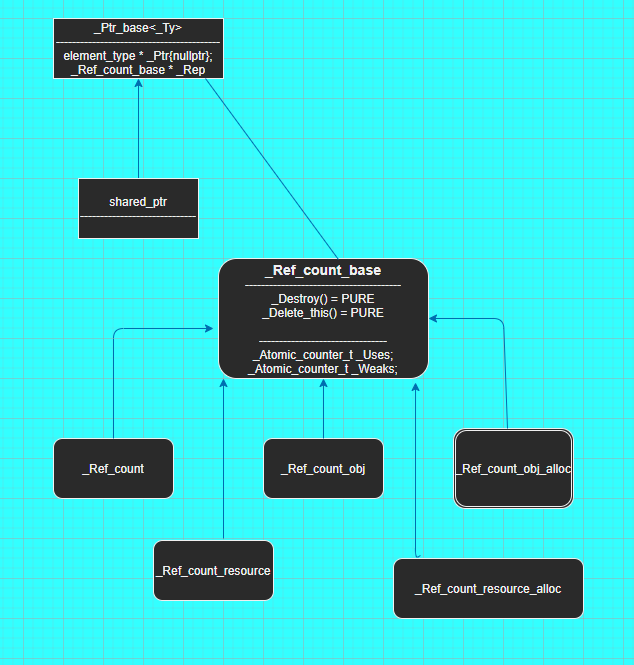
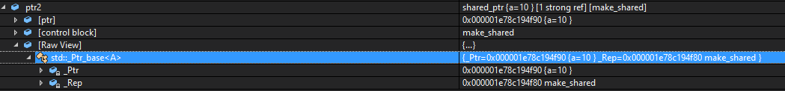

---
html:
  embed_local_images: false
  embed_svg: true
  offline: false
  toc: true

print_background: false
---

# c++ 智能指针与MS实现剖析
总所周知 c++11标准为我们引入了三个智能指针分别是[std::shared_ptr](https://en.cppreference.com/w/cpp/memory/shared_ptr)、[std::weak_ptr](https://en.cppreference.com/w/cpp/memory/unique_ptr)、[std::unique_ptr](https://en.cppreference.com/w/cpp/memory/weak_ptr)，回望历史c++98中还有[std::auto_ptr](https://en.cppreference.com/w/cpp/memory/auto_ptr)但是由于实现的缺陷在c++11已被声明弃用，c++17已没有它，所以在我们的项目中不应该使用它了

智能指针基本思想是[RAII](https://en.cppreference.com/w/cpp/language/raii),而RAII是c++设计中一个非常有用的范式。那何为RAII呢
> RAII(Resource Acquisition Is Initialization) 可翻译为资源获取即初始化，核心的东西有两个
> - 将资源的获取放在类的构造函数里，资源的释放放在类的析构函数里，
> - 栈展开(stack unwinding) 保证局部变量的析构函数能够执行

资源可以为内存、锁、句柄等等，如果没有释放会造成资源泄漏和程序出错，而释放的方式有时候写起来却没那么容易，看如下代码
```
void readText()
{
  FILE *f = fopen("demo.txt", 'r');
  if (!func1()) 
  {
    fclose(f);
    return;
  }

  if (!fun2())
  {
    fclose(f);
    return;
  }

  fread(....)
  fclose(f);
}
```

如果使用RAII特性就能优雅的写出以下代码
```
class scoped_file
{
  public:
     scoped_file(FILE *file)
     : m_file(file)
     {

     }

     ~scoped_file()
     {
       if (m_file)
        fclose(m_file);

       m_file = nullptr;
     }

  private:
     FILE *m_file{nullptr};
}

void readText()
{
    FILE *f = fopen("demo.txt", 'r');
    scoped_file scpfile(f);

    if (!func1()) 
      return;

   if (!fun2())
      return;

    fread(....)
}
```

其实RAII思想在c++和QT使用还是相当广泛的，如c++11的std::lock_guard、std::unique_lock、 std::shared_lock,以及我们接下来要介绍的shared_ptr、weak_ptr、unique_ptr
QT中的QScopedPointer、QScopeGuard等等

## 1. shared_ptr
> shared_ptr通过引用计数实现共享管理同一个资源
> 当多个shared_ptr管理同一个指针时仅当最后一个shared_ptr对象析构时拥有的指针才会被释放

#### 使用举例
##### new形式
```
   std::shared_ptr<A> sp(new A())
```

##### make_shared
```
   std::shared_ptr<A> sp = std::make_shared<A>();
```

#### 向shared_ptr传递删除器
```
A* p = new A;
std::shared_ptr<A> ptr(p, [](A* p) {
  if (p)
	{
    // 做些额外的事情
    ......
    ......

		delete p;
	}
});
```

#### unique_ptr转换为shared_ptr
```
std::unique_ptr<A> a = std::make_unique<A>();
	std::shared_ptr<A> ptr = std::move(a);
```

#### 易犯错误
##### 循环引用导致内存泄漏
```
class Widget
{
public:
	Widget() { printf(__FUNCTION__ "\n"); }
	virtual ~Widget() { printf(__FUNCTION__ "\n"); }
	std::vector<std::shared_ptr<Widget>> children;
	std::shared_ptr<Widget> parent;
};

int main()
{
	{
		std::shared_ptr<Widget> parent(new Widget);
		std::shared_ptr<Widget> child(new Widget);
		parent->children.push_back(child);
		child->parent = parent;
		parent1 = parent;
	}
}

```
##### 同个裸指针构造多个shared_ptr对象导致二次释放
```
int *a = new int;
std::shared_ptr<int> p1(a);
std::shared_ptr<int> p2(a);
```
```
    void func(A* p)
    {
      std::shared_ptr<A> sp(p);
      sp.doSomething();
    }
   
   int main()
   {
      std::shared_ptr<A> sp(new A());
      func(sp.get());
   }
```

#### 实现原理 
原理是 引用计数(reference counting)
引用计数指的是: 所有管理同一个裸指针（raw pointer）的shared_ptr都会共享一个引用计数器，每当一个shared_ptr被赋值（或拷贝构造）给其它shared_ptr时，这个共享的引用计数器就会加会1，当一个shared_ptr析构或者被用于管理其它裸指针时(reset)，这个引用计数器就会减1，如果减少引用计数器后值为0，那么说明它是管理这个指针的最后一个shared_ptr了，于是我们可以释放指针指向的资源。

理解shared_ptr的关键在于shared_ptr内部的核心：control block（控制块）,看下图


管理同个内存的多个shared_ptr指向同一个control block



接下来结合源码分析 [C:\Program Files (x86)\Microsoft Visual Studio\2017\Enterprise\VC\Tools\MSVC\14.16.27023\include\memory]

*关注点：*
- 引用计数
- 内存如何释放 

#### 引申话题
- 定位shared_ptr互相循环导致的内存泄漏
  - Visual studio - Diagnostics Tools
  - log


### 2. weak_ptr
可以简单的理解weak_ptr是shared_ptr的观察者，它是与特定的一个shared_ptr绑定的，存在最大的意义就是解决shared_ptr循环引用的问题，通过lock生成一个shared_ptr，通过expired可以查询它所观察的shared_ptr管理的资源是否已经释放

#### lock expired
#### 实现原理

### 3. unique_ptr
强调的是独享、独占,言下之意在某一时刻有仅能有一个unique_ptr指向特定的对象，它不支持复制、当参数按值传递给函数，但支持c++11的移动语义：意味着内存资源所有权从 unique_ptr转移到另外一个unique_ptr,并且原有的unique_ptr不再拥有此资源

#### 使用举例
##### make_unique
```
   std::unique_ptr<A> sp = std::make_unique<A>();
```
#### 向unique_ptr传递删除器
```
void deleter(A *p)
{
	delete p;
	p = nullptr;
}

std::unique_ptr<A, decltype(deleter)*> up(new A(), deleter);
```

#### 特别之处
```
class A
{

};

class B
{
public:
	std::unique_ptr<A> return1()
	{
		return std::unique_ptr<A>(new A);
	}

	std::unique_ptr<A> return2()
	{
		std::unique_ptr<A> a(new A);
		return a;
	}
};

int main()
{
	B b;
	auto b1 = b.return1();
	auto b2 = b.return2();

  return 0;
}
```
#### 易犯错误
##### 同个裸指针构造多个unique_ptr对象导致二次释放
```
A *ptr = new A();
unique_ptr<A> p1{ ptr };
unique_ptr<A> p2{ ptr }; 
```

#### 实现原理


结合源码分析 [C:\Program Files (x86)\Microsoft Visual Studio\2017\Enterprise\VC\Tools\MSVC\14.16.27023\include\memory]

### make_shared make_unique 优先于 new XXX
#### make_shared 优点
###### 1. 减少内存分配次数
   ``` 
   A* aaa = new A
   std::shared_ptr<A> ptr1(aaa);
   ```
   涉及了两次分配内存
   ①. new A
   ②. new _Ref_count  
  
######2. 有效避免内存碎片
```
   A* aaa = new A
   std::shared_ptr<A> ptr1(aaa);

   std::shared_ptr<A> ptr2 = std::make_shared<A>();
```
看下ptr1和ptr2内存布局情况，如图
ptr1内存


ptr2内存


######3. 异常安全
```
void func(std::unique_ptr<Widget> ptr, int param)
{
    .......
}

func(std::unique_ptr<Widget>(new Widget), calculateValue());
```
为了调用func函数 需要涉及三个求值过程
1. new Widget
2. std::unique_ptr<Widget>() 构造函数执行
3. calculateValue() 执行

c++ 标准委员会没有对上述求值的先后顺序做硬性要求(https://isocpp.org/blog/2016/08/quick-q-why-doesnt-cpp-have-a-specified-order-for-evaluating-function-argum)，所以假设以下执行顺序
1. new Widget
3. calculateValue() 执行
2. std::unique_ptr<Widget>() 构造函数执行

如果2执行发生异常，那么1中的生成的对象就会被泄漏，因为此时new Widget返回的裸指针还未保存到unique_ptr中

### std::enable_shared_from_this
#### 主要解决由shred_ptr对象自身this构造shared_ptr引起的潜在问题
##### 看看以下代码的问题
```
class Task
{
public:
	Task()
	{

	}

	~Task()
	{

	}

	void func()
	{
		++a;
	}

	void doAsync()
	{
		std::thread t([=]() {
			Sleep(3000);
			func();
		});

		t.detach();
	}

private:
	int a{ 10 };
};

int main(int argc, char *argv[])
{
  {
    std::shared_ptr<Task> a(new Task());
    a->doAsync();
  }

  system("pause");
}
    
```

##### 应用enable_shared_from_this解决问题
```
class TaskSafe : public std::enable_shared_from_this<TaskSafe>
{
public:
	TaskSafe()
	{

	}

	~TaskSafe()
	{

	}

	void func()
	{
		++a;
	}

	void doAsync()
	{
		std::thread t([self = shared_from_this()]() {
			Sleep(3000);
			self->func();
		});

		t.detach();
	}

private:
	int a{ 10 };
};

int main(int argc, char *argv[])
{
  {
    std::shared_ptr<TaskSafe> a(new TaskSafe());
    a->doAsync();
  }

  system("pause");
}
    
```

##### 结合源码分析 enable_shared_from_this实现
```
enable_shared_from_this对引用计数的影响,看如下代码，重点关注 _Ref_count_base::_Uses 和 _Ref_count_base::_Weaks

class A : public std::enable_shared_from_this<A>
{

};

class B
{

};

std::shared_ptr<B> ptr1(std::make_shared<B>());
std::shared_ptr<B> ptr2(ptr1);

std::shared_ptr<A> ptr3(std::make_shared<A>());
std::shared_ptr<A> ptr4 = ptr3->shared_from_this();

```

### 与QT智能指针对比
std::shard_ptr  <-------> QSharedPointer
std::weak_ptr   <-------> QWeakPointer
std::unique_ptr <-------> QScopedPointer

##### 重点讲下QPointer
###### 问题代码
```
class MyWindow : public QWidget
{
  .......
  void popModelessDialog()
  {
    QMyDialog *pDialog = new MyDialog(this);
    if (pDialog->exec() == QDialog::Accepted)
    {
       ........
    }
    delete pDialog;
  }
}
```
##### QPointer 是怎么实现的，核心在结构 ExternalRefCountData
```
struct ExternalRefCountData
{
        typedef void (*DestroyerFn)(ExternalRefCountData *);
        QBasicAtomicInt weakref;
        QBasicAtomicInt strongref;
        DestroyerFn destroyer;

        inline ExternalRefCountData(DestroyerFn d)
            : destroyer(d)
        {
            strongref.storeRelaxed(1);
            weakref.storeRelaxed(1);
        }

        .........
}

inline QWeakPointer(X *ptr, bool) : d(ptr ? Data::getAndRef(ptr) : nullptr), value(ptr)
{ }

QtSharedPointer::ExternalRefCountData *QtSharedPointer::ExternalRefCountData::getAndRef(const QObject *obj)
{
    Q_ASSERT(obj);
    QObjectPrivate *d = QObjectPrivate::get(const_cast<QObject *>(obj));
    Q_ASSERT_X(!d->wasDeleted, "QWeakPointer", "Detected QWeakPointer creation in a QObject being deleted");

    ExternalRefCountData *that = d->sharedRefcount.loadRelaxed();
    if (that) {
        that->weakref.ref();
        return that;
    }

    // we can create the refcount data because it doesn't exist
    ExternalRefCountData *x = new ExternalRefCountData(Qt::Uninitialized);
    x->strongref.storeRelaxed(-1);
    x->weakref.storeRelaxed(2);  // the QWeakPointer that called us plus the QObject itself

    ExternalRefCountData *ret;
    if (d->sharedRefcount.testAndSetOrdered(nullptr, x, ret)) {     // ought to be release+acquire; this is acq_rel+acquire
        ret = x;
    } else {
        // ~ExternalRefCountData has a Q_ASSERT, so we use this trick to
        // only execute this if Q_ASSERTs are enabled
        Q_ASSERT((x->weakref.storeRelaxed(0), true));
        delete x;
        ret->weakref.ref();
    }
    return ret;
}

QObject::~QObject()
{
    Q_D(QObject);
    d->wasDeleted = true;
    d->blockSig = 0; // unblock signals so we always emit destroyed()

    QtSharedPointer::ExternalRefCountData *sharedRefcount = d->sharedRefcount.loadRelaxed();
    if (sharedRefcount) {
        if (sharedRefcount->strongref.loadRelaxed() > 0) {
            qWarning("QObject: shared QObject was deleted directly. The program is malformed and may crash.");
            // but continue deleting, it's too late to stop anyway
        }

        // indicate to all QWeakPointers that this QObject has now been deleted
        sharedRefcount->strongref.storeRelaxed(0);
        if (!sharedRefcount->weakref.deref())
            delete sharedRefcount;
    }

    .........
}
```
### 扩展阅读 CppCoreGuidelines-智能指针使用方式(R.20 ~ R.37)
[R.20: Use unique_ptr or shared_ptr to represent ownership](https://github.com/isocpp/CppCoreGuidelines/blob/master/CppCoreGuidelines.md#Rr-owner)
[R.21: Prefer unique_ptr over shared_ptr unless you need to share ownership](https://github.com/isocpp/CppCoreGuidelines/blob/master/CppCoreGuidelines.md#Rr-unique)
[R.22: Use make_shared() to make shared_ptrs](https://github.com/isocpp/CppCoreGuidelines/blob/master/CppCoreGuidelines.md#Rr-make_shared)
[R.23: Use make_unique() to make unique_ptrs]("https://github.com/isocpp/CppCoreGuidelines/blob/master/CppCoreGuidelines.md#Rr-make_unique)
[R.24: Use std::weak_ptr to break cycles of shared_ptrs](https://github.com/isocpp/CppCoreGuidelines/blob/master/CppCoreGuidelines.md#Rr-weak_ptr)
[R.30: Take smart pointers as parameters only to explicitly express lifetime semantics](https://github.com/isocpp/CppCoreGuidelines/blob/master/CppCoreGuidelines.md#Rr-smartptrparam)
[R.31: If you have non-std smart pointers, follow the basic pattern from std](https://github.com/isocpp/CppCoreGuidelines/blob/master/CppCoreGuidelines.md#Rr-smart)
[R.32: Take a unique_ptr parameter to express that a function assumes ownership of a widget](https://github.com/isocpp/CppCoreGuidelines/blob/master/CppCoreGuidelines.md#Rr-uniqueptrparam)
[R.33: Take a unique_ptr& parameter to express that a function reseats the widget](https://github.com/isocpp/CppCoreGuidelines/blob/master/CppCoreGuidelines.md#Rr-reseat)
[R.34: Take a shared_ptr parameter to express shared ownership](https://github.com/isocpp/CppCoreGuidelines/blob/master/CppCoreGuidelines.md#Rr-sharedptrparam-owner)
[R.35: Take a shared_ptr& parameter to express that a function might reseat the shared pointer](https://github.com/isocpp/CppCoreGuidelines/blob/master/CppCoreGuidelines.md#Rr-sharedptrparam)
[R.36: Take a const shared_ptr& parameter to express that it might retain a reference count to the object](https://github.com/isocpp/CppCoreGuidelines/blob/master/CppCoreGuidelines.md#Rr-sharedptrparam-const)
[R.37: Do not pass a pointer or reference obtained from an aliased smart pointer](https://github.com/isocpp/CppCoreGuidelines/blob/master/CppCoreGuidelines.md#Rr-smartptrget)